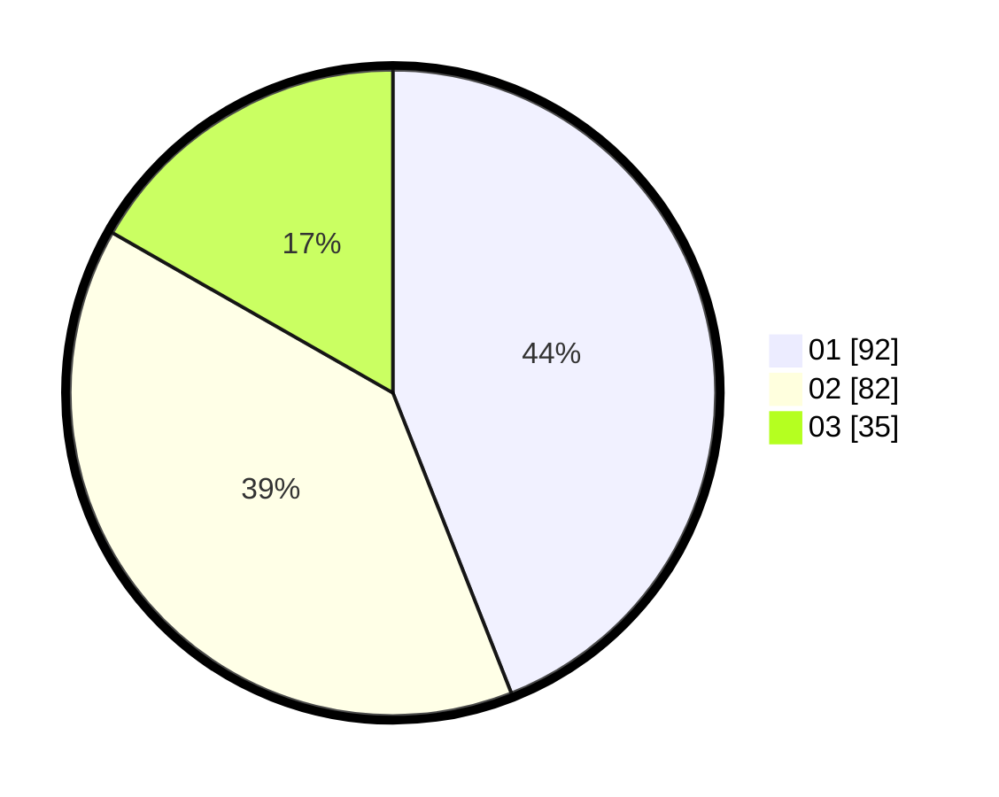

# Hasil

Hasil perolehan suara paslon dapat dilihat pada file paslon-01.txt, paslon-02.txt, dan paslon-03.txt.

Jika tidak ada, artinya data tersebut belum ada pada SIREKAP.

## Perolehan Suara

 * Paslon 01: **92**.
 * Paslon 02: **82**.
 * Paslon 03: **35**.

## Foto C Plano

https://sirekap-obj-formc.kpu.go.id/10db/pemilu/ppwp/31/75/01/10/04/3175011004037-20240216-081802--1ea13a6a-df9d-42bb-89aa-6527333c6c47.jpg

https://sirekap-obj-formc.kpu.go.id/10db/pemilu/ppwp/31/75/01/10/04/3175011004037-20240216-081804--ac206179-dc7d-4a88-9c8b-1dc43812777b.jpg

https://sirekap-obj-formc.kpu.go.id/10db/pemilu/ppwp/31/75/01/10/04/3175011004037-20240216-081803--390e10a3-935f-4341-8cdd-1bf4416cb423.jpg

## DATA PEMILIH TETAP

Jumlah pemilih dalam DPT: **204**.
 * L: **89**.
 * P: **115**.

## DATA PENGGUNA HAK PILIH

Jumlah pengguna hak pilih dalam DPT: **204**.
 * L: **89**.
 * P: **115**.

Jumlah pengguna hak pilih dalam DPTb: **8**.
 * L: **4**.
 * P: **4**.

Jumlah pengguna hak pilih dalam DPK: **1**.
 * L: **0**.
 * P: **1**.

Jumlah pengguna hak pilih: **213**.
 * L: **93**.
 * P: **120**.

## JUMLAH SUARA SAH DAN TIDAK SAH

JUMLAH SELURUH SUARA SAH: **209**.

JUMLAH SUARA TIDAK SAH: **4**.

JUMLAH SELURUH SUARA SAH DAN SUARA TIDAK SAH: **213**.
