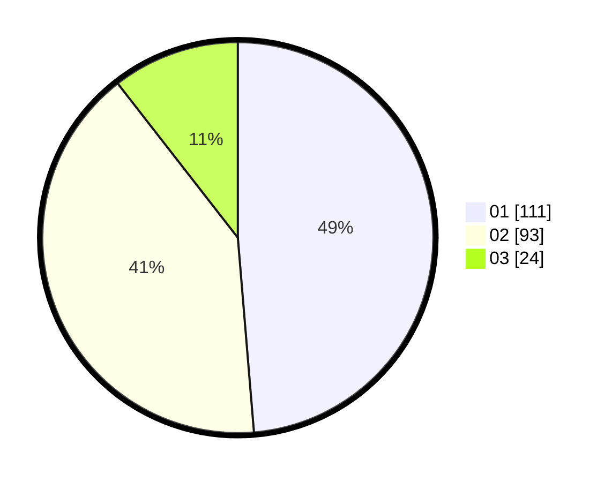

# Hasil

Hasil perolehan suara paslon dapat dilihat pada file paslon-01.txt, paslon-02.txt, dan paslon-03.txt.

Jika tidak ada, artinya data tersebut belum ada pada SIREKAP.

## Perolehan Suara

 * Paslon 01: **111**.
 * Paslon 02: **93**.
 * Paslon 03: **24**.

## Foto C Plano

https://sirekap-obj-formc.kpu.go.id/7321/pemilu/ppwp/31/75/01/10/04/3175011004040-20240214-200132--aa953eac-2fd3-4703-905e-8b43b67c29ed.jpg

https://sirekap-obj-formc.kpu.go.id/7321/pemilu/ppwp/31/75/01/10/04/3175011004040-20240214-200325--2f46af01-723a-4b10-a408-558ed651dfc2.jpg

https://sirekap-obj-formc.kpu.go.id/7321/pemilu/ppwp/31/75/01/10/04/3175011004040-20240214-200511--d222bee7-7b5a-457b-8f83-71de4da9d344.jpg

## DATA PEMILIH TETAP

Jumlah pemilih dalam DPT: **289**.
 * L: **135**.
 * P: **154**.

## DATA PENGGUNA HAK PILIH

Jumlah pengguna hak pilih dalam DPT: **229**.
 * L: **108**.
 * P: **121**.

Jumlah pengguna hak pilih dalam DPTb: **0**.
 * L: **0**.
 * P: **0**.

Jumlah pengguna hak pilih dalam DPK: **0**.
 * L: **0**.
 * P: **0**.

Jumlah pengguna hak pilih: **229**.
 * L: **108**.
 * P: **121**.

## JUMLAH SUARA SAH DAN TIDAK SAH

JUMLAH SELURUH SUARA SAH: **228**.

JUMLAH SUARA TIDAK SAH: **1**.

JUMLAH SELURUH SUARA SAH DAN SUARA TIDAK SAH: **229**.
