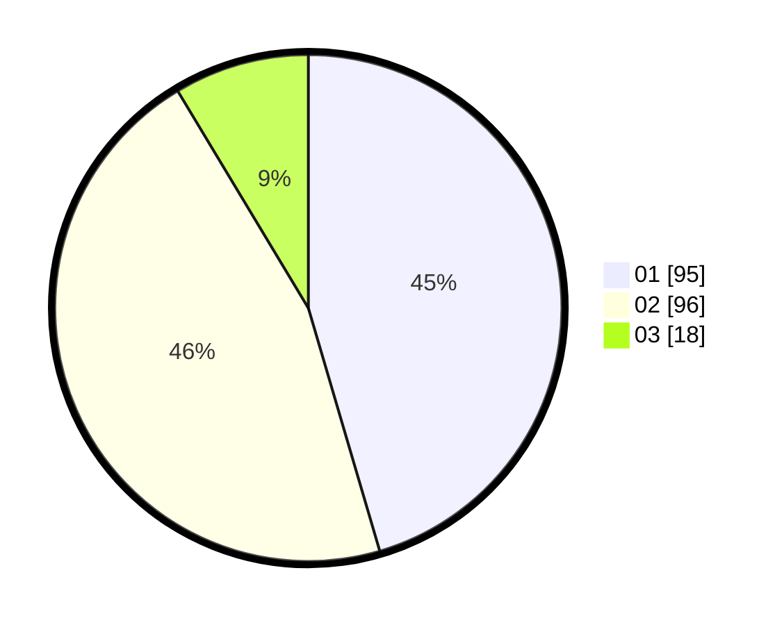

# Hasil

Hasil perolehan suara paslon dapat dilihat pada file paslon-01.txt, paslon-02.txt, dan paslon-03.txt.

Jika tidak ada, artinya data tersebut belum ada pada SIREKAP.

## Perolehan Suara

 * Paslon 01: **95**.
 * Paslon 02: **96**.
 * Paslon 03: **18**.

## Foto C Plano

https://sirekap-obj-formc.kpu.go.id/e125/pemilu/ppwp/31/75/01/10/04/3175011004041-20240214-185904--5f7e512b-494d-4bea-8a75-3f9d87e19977.jpg

https://sirekap-obj-formc.kpu.go.id/e125/pemilu/ppwp/31/75/01/10/04/3175011004041-20240214-185910--5e495f33-c461-4283-ab90-115c5dea55a7.jpg

https://sirekap-obj-formc.kpu.go.id/e125/pemilu/ppwp/31/75/01/10/04/3175011004041-20240214-185923--48e2e48e-7164-474c-9278-917af6e2ab30.jpg

## DATA PEMILIH TETAP

Jumlah pemilih dalam DPT: **288**.
 * L: **141**.
 * P: **147**.

## DATA PENGGUNA HAK PILIH

Jumlah pengguna hak pilih dalam DPT: **210**.
 * L: **98**.
 * P: **112**.

Jumlah pengguna hak pilih dalam DPTb: **0**.
 * L: **0**.
 * P: **0**.

Jumlah pengguna hak pilih dalam DPK: **1**.
 * L: **1**.
 * P: **0**.

Jumlah pengguna hak pilih: **211**.
 * L: **99**.
 * P: **112**.

## JUMLAH SUARA SAH DAN TIDAK SAH

JUMLAH SELURUH SUARA SAH: **209**.

JUMLAH SUARA TIDAK SAH: **2**.

JUMLAH SELURUH SUARA SAH DAN SUARA TIDAK SAH: **211**.
