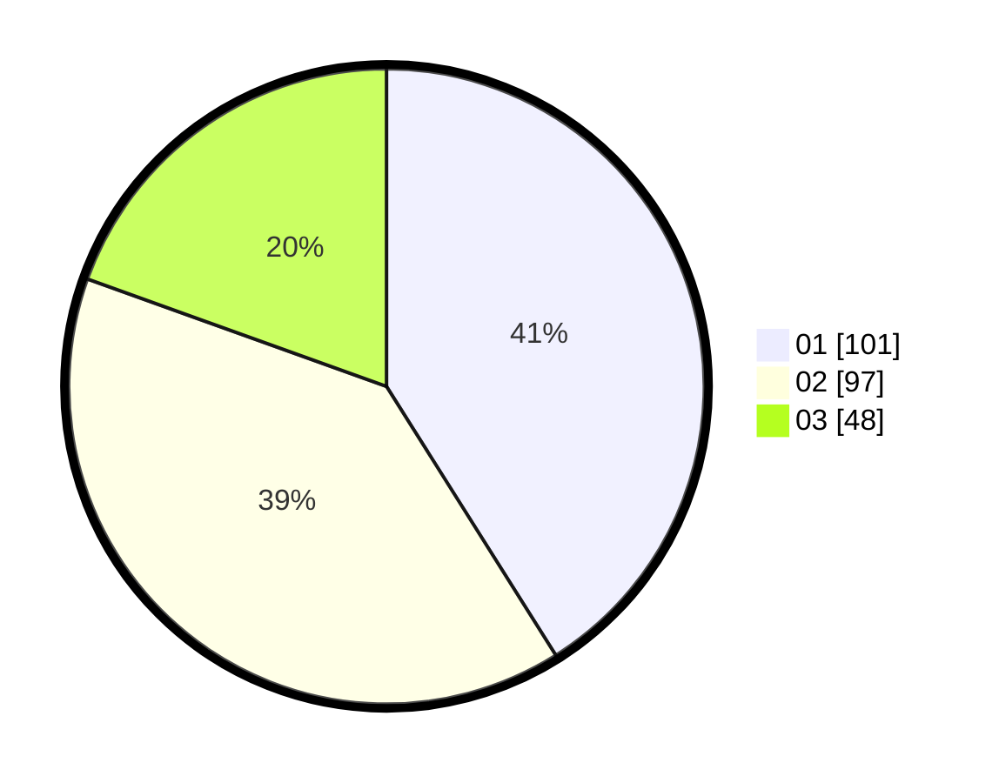

# Hasil

Hasil perolehan suara paslon dapat dilihat pada file paslon-01.txt, paslon-02.txt, dan paslon-03.txt.

Jika tidak ada, artinya data tersebut belum ada pada SIREKAP.

## Perolehan Suara

 * Paslon 01: **101**.
 * Paslon 02: **97**.
 * Paslon 03: **48**.

## Foto C Plano

https://sirekap-obj-formc.kpu.go.id/5411/pemilu/ppwp/31/75/01/10/04/3175011004047-20240214-212207--3718da91-a2be-4883-9bee-11c77db40d8e.jpg

https://sirekap-obj-formc.kpu.go.id/5411/pemilu/ppwp/31/75/01/10/04/3175011004047-20240214-213538--6d75d169-d807-4139-a959-f23614df6646.jpg

https://sirekap-obj-formc.kpu.go.id/5411/pemilu/ppwp/31/75/01/10/04/3175011004047-20240214-213907--c72737e6-9948-41a6-81a9-c9cfbbdb5241.jpg
