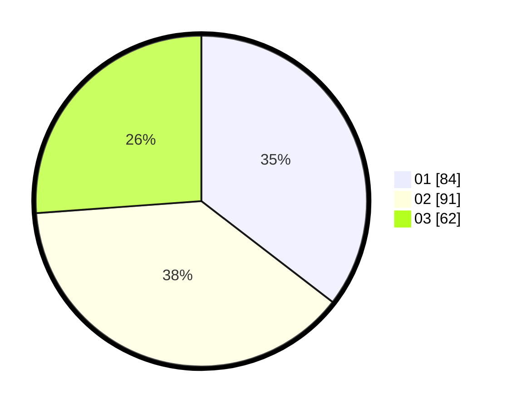

# Hasil

Hasil perolehan suara paslon dapat dilihat pada file paslon-01.txt, paslon-02.txt, dan paslon-03.txt.

Jika tidak ada, artinya data tersebut belum ada pada SIREKAP.

## Perolehan Suara

 * Paslon 01: **84**.
 * Paslon 02: **91**.
 * Paslon 03: **62**.

## Foto C Plano

https://sirekap-obj-formc.kpu.go.id/541c/pemilu/ppwp/31/75/01/10/04/3175011004049-20240216-122038--9f145b8b-0f97-41fc-8227-9cc4d27d9fd6.jpg

https://sirekap-obj-formc.kpu.go.id/541c/pemilu/ppwp/31/75/01/10/04/3175011004049-20240216-122043--b4b14e4d-22b0-4706-a360-74c2fa965833.jpg

https://sirekap-obj-formc.kpu.go.id/541c/pemilu/ppwp/31/75/01/10/04/3175011004049-20240216-122040--3b08c088-ba04-4eaf-bfd7-41da9449c456.jpg

## DATA PEMILIH TETAP

Jumlah pemilih dalam DPT: **231**.
 * L: **105**.
 * P: **126**.

## DATA PENGGUNA HAK PILIH

Jumlah pengguna hak pilih dalam DPT: **231**.
 * L: **105**.
 * P: **126**.

Jumlah pengguna hak pilih dalam DPTb: **8**.
 * L: **0**.
 * P: **8**.

Jumlah pengguna hak pilih dalam DPK: **3**.
 * L: **1**.
 * P: **2**.

Jumlah pengguna hak pilih: **242**.
 * L: **106**.
 * P: **136**.

## JUMLAH SUARA SAH DAN TIDAK SAH

JUMLAH SELURUH SUARA SAH: **237**.

JUMLAH SUARA TIDAK SAH: **5**.

JUMLAH SELURUH SUARA SAH DAN SUARA TIDAK SAH: **242**.
