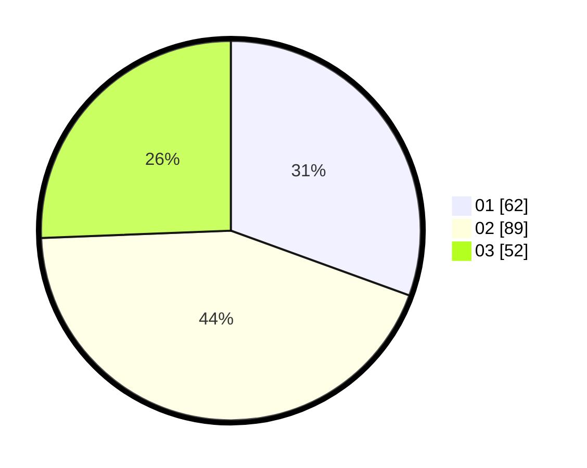

# Hasil

Hasil perolehan suara paslon dapat dilihat pada file paslon-01.txt, paslon-02.txt, dan paslon-03.txt.

Jika tidak ada, artinya data tersebut belum ada pada SIREKAP.

## Perolehan Suara

 * Paslon 01: **62**.
 * Paslon 02: **89**.
 * Paslon 03: **52**.

## Foto C Plano

https://sirekap-obj-formc.kpu.go.id/389d/pemilu/ppwp/31/75/01/10/04/3175011004050-20240214-211008--65dd558a-1ec5-460c-8eef-d35ec5210abf.jpg

https://sirekap-obj-formc.kpu.go.id/389d/pemilu/ppwp/31/75/01/10/04/3175011004050-20240214-211123--e0a0a3d0-806f-4852-b5ab-8b1f7c2c092c.jpg

https://sirekap-obj-formc.kpu.go.id/389d/pemilu/ppwp/31/75/01/10/04/3175011004050-20240214-232524--975f3196-3a38-4b2a-8988-88b9c3067fa2.jpg

## DATA PEMILIH TETAP

Jumlah pemilih dalam DPT: **550**.
 * L: **641**.
 * P: **170**.

## DATA PENGGUNA HAK PILIH

Jumlah pengguna hak pilih dalam DPT: **4**.
 * L: **43**.
 * P: **110**.

Jumlah pengguna hak pilih dalam DPTb: **0**.
 * L: **0**.
 * P: **0**.

Jumlah pengguna hak pilih dalam DPK: **5**.
 * L: **0**.
 * P: **0**.

Jumlah pengguna hak pilih: **0**.
 * L: **43**.
 * P: **116**.

## JUMLAH SUARA SAH DAN TIDAK SAH

JUMLAH SELURUH SUARA SAH: **203**.

JUMLAH SUARA TIDAK SAH: **6**.

JUMLAH SELURUH SUARA SAH DAN SUARA TIDAK SAH: **209**.
