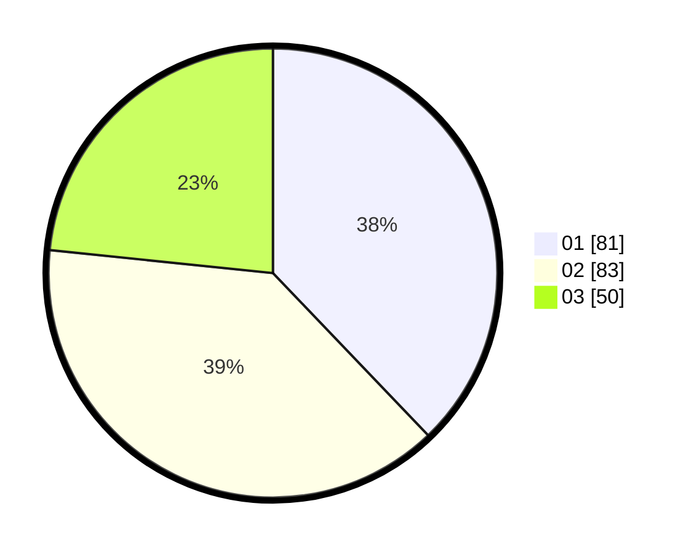

# Hasil

Hasil perolehan suara paslon dapat dilihat pada file paslon-01.txt, paslon-02.txt, dan paslon-03.txt.

Jika tidak ada, artinya data tersebut belum ada pada SIREKAP.

## Perolehan Suara

 * Paslon 01: **81**.
 * Paslon 02: **83**.
 * Paslon 03: **50**.

## Foto C Plano

https://sirekap-obj-formc.kpu.go.id/4125/pemilu/ppwp/31/75/01/10/04/3175011004051-20240215-001940--79ba8aad-bdd5-47b3-bccb-38550162b307.jpg

https://sirekap-obj-formc.kpu.go.id/4125/pemilu/ppwp/31/75/01/10/04/3175011004051-20240215-002237--f124cfd7-1a0a-4ce5-b0c1-2dfce6f7a213.jpg

https://sirekap-obj-formc.kpu.go.id/4125/pemilu/ppwp/31/75/01/10/04/3175011004051-20240215-002819--d4527c1c-11bb-492e-834d-090a4d28c122.jpg
