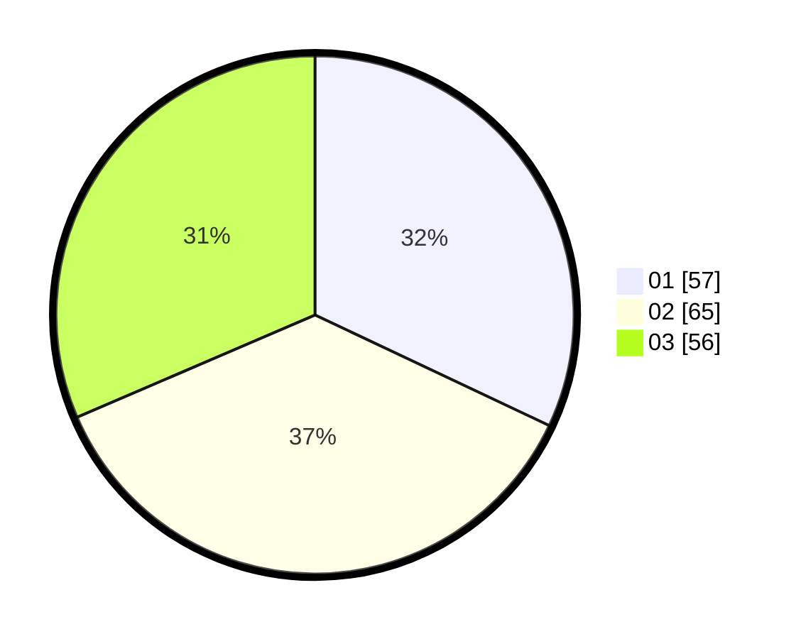

# Hasil

Hasil perolehan suara paslon dapat dilihat pada file paslon-01.txt, paslon-02.txt, dan paslon-03.txt.

Jika tidak ada, artinya data tersebut belum ada pada SIREKAP.

## Perolehan Suara

 * Paslon 01: **57**.
 * Paslon 02: **65**.
 * Paslon 03: **56**.

## Foto C Plano

https://sirekap-obj-formc.kpu.go.id/be15/pemilu/ppwp/31/75/01/10/04/3175011004053-20240215-035231--93109f7d-0c71-45f7-826e-c1556297cc39.jpg

https://sirekap-obj-formc.kpu.go.id/be15/pemilu/ppwp/31/75/01/10/04/3175011004053-20240215-035445--73288875-aac4-472d-bd6b-838594566ac2.jpg

https://sirekap-obj-formc.kpu.go.id/be15/pemilu/ppwp/31/75/01/10/04/3175011004053-20240215-035611--8fe33b90-ad89-448f-811d-d74c3c9d7227.jpg
