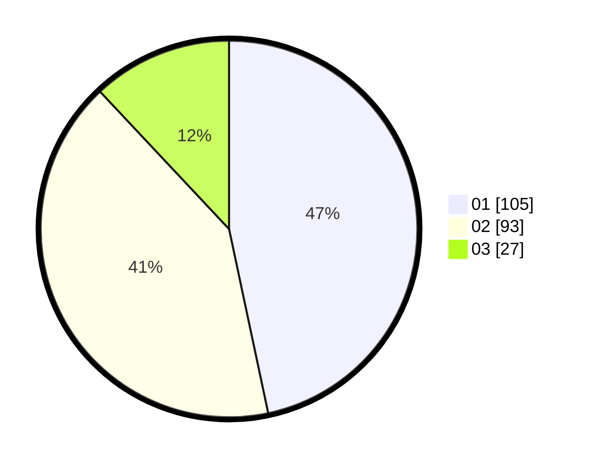

# Hasil

Hasil perolehan suara paslon dapat dilihat pada file paslon-01.txt, paslon-02.txt, dan paslon-03.txt.

Jika tidak ada, artinya data tersebut belum ada pada SIREKAP.

## Perolehan Suara

 * Paslon 01: **105**.
 * Paslon 02: **93**.
 * Paslon 03: **27**.

## Foto C Plano

https://sirekap-obj-formc.kpu.go.id/b4b4/pemilu/ppwp/31/75/01/10/04/3175011004054-20240215-003402--b19e8a8e-c38c-4038-b4b2-606732852fa7.jpg

https://sirekap-obj-formc.kpu.go.id/b4b4/pemilu/ppwp/31/75/01/10/04/3175011004054-20240215-002745--42169b66-521d-4c66-8c96-da2ea8ff16e8.jpg

https://sirekap-obj-formc.kpu.go.id/b4b4/pemilu/ppwp/31/75/01/10/04/3175011004054-20240214-191157--6623f800-38c4-48a2-8951-00197b73ac3b.jpg

## DATA PEMILIH TETAP

Jumlah pemilih dalam DPT: **292**.
 * L: **142**.
 * P: **150**.

## DATA PENGGUNA HAK PILIH

Jumlah pengguna hak pilih dalam DPT: **223**.
 * L: **104**.
 * P: **119**.

Jumlah pengguna hak pilih dalam DPTb: **1**.
 * L: **1**.
 * P: **0**.

Jumlah pengguna hak pilih dalam DPK: **4**.
 * L: **2**.
 * P: **2**.

Jumlah pengguna hak pilih: **228**.
 * L: **107**.
 * P: **121**.

## JUMLAH SUARA SAH DAN TIDAK SAH

JUMLAH SELURUH SUARA SAH: **225**.

JUMLAH SUARA TIDAK SAH: **3**.

JUMLAH SELURUH SUARA SAH DAN SUARA TIDAK SAH: **228**.
