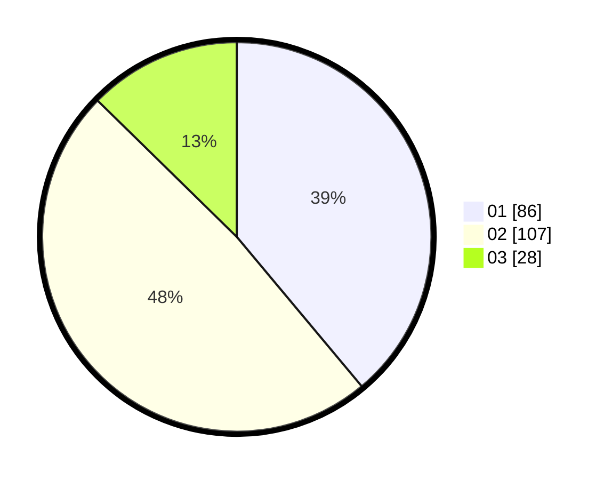

# Hasil

Hasil perolehan suara paslon dapat dilihat pada file paslon-01.txt, paslon-02.txt, dan paslon-03.txt.

Jika tidak ada, artinya data tersebut belum ada pada SIREKAP.

## Perolehan Suara

 * Paslon 01: **86**.
 * Paslon 02: **107**.
 * Paslon 03: **28**.

## Foto C Plano

https://sirekap-obj-formc.kpu.go.id/4768/pemilu/ppwp/31/75/01/10/04/3175011004057-20240214-224719--d838119e-f698-4a29-ac22-05824984229d.jpg

https://sirekap-obj-formc.kpu.go.id/4768/pemilu/ppwp/31/75/01/10/04/3175011004057-20240214-224204--855afdc6-725e-43c7-b929-9825c5ec6183.jpg

https://sirekap-obj-formc.kpu.go.id/4768/pemilu/ppwp/31/75/01/10/04/3175011004057-20240214-204422--223a43fd-6d22-4817-b1ab-ba5d1583c883.jpg
