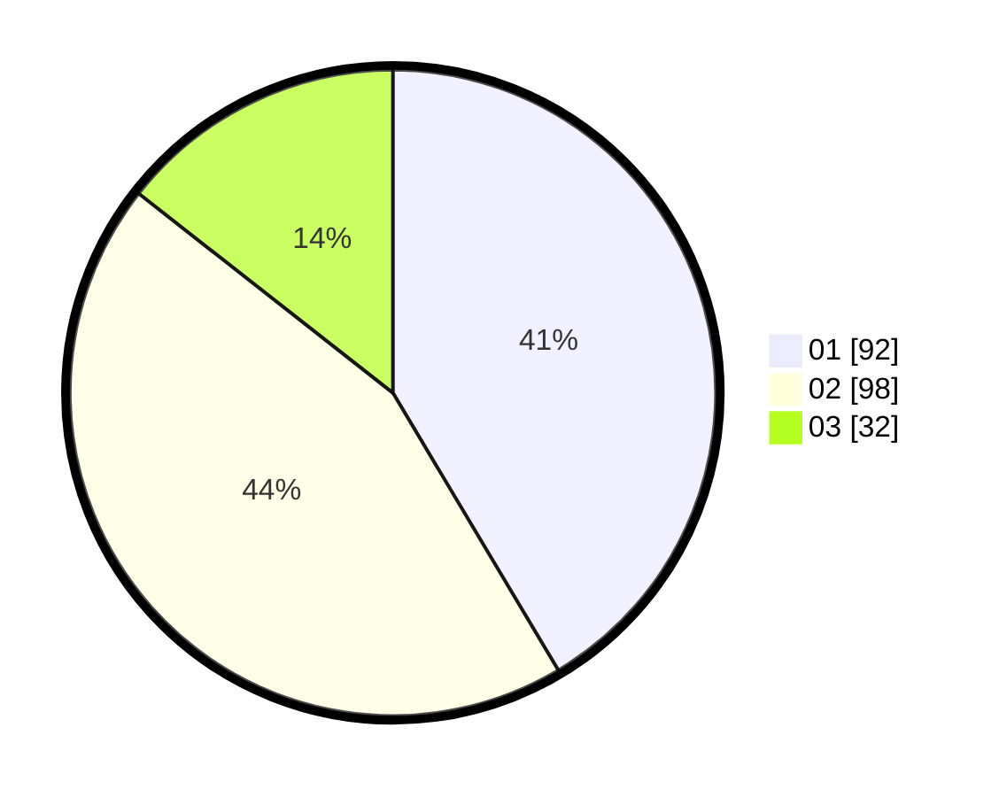

# Hasil

Hasil perolehan suara paslon dapat dilihat pada file paslon-01.txt, paslon-02.txt, dan paslon-03.txt.

Jika tidak ada, artinya data tersebut belum ada pada SIREKAP.

## Perolehan Suara

 * Paslon 01: **92**.
 * Paslon 02: **98**.
 * Paslon 03: **32**.

## Foto C Plano

https://sirekap-obj-formc.kpu.go.id/1c13/pemilu/ppwp/31/75/01/10/04/3175011004058-20240214-195214--a8a87177-d9fa-4d60-a547-97aed930a45e.jpg

https://sirekap-obj-formc.kpu.go.id/1c13/pemilu/ppwp/31/75/01/10/04/3175011004058-20240214-204845--64b04957-09bf-42b3-901a-bcaf553b7809.jpg

https://sirekap-obj-formc.kpu.go.id/1c13/pemilu/ppwp/31/75/01/10/04/3175011004058-20240214-195907--b0d9c777-b7bb-445b-91ed-baeefa1a33b2.jpg

## DATA PEMILIH TETAP

Jumlah pemilih dalam DPT: **294**.
 * L: **133**.
 * P: **161**.

## DATA PENGGUNA HAK PILIH

Jumlah pengguna hak pilih dalam DPT: **222**.
 * L: **99**.
 * P: **123**.

Jumlah pengguna hak pilih dalam DPTb: **0**.
 * L: **0**.
 * P: **0**.

Jumlah pengguna hak pilih dalam DPK: **5**.
 * L: **2**.
 * P: **3**.

Jumlah pengguna hak pilih: **227**.
 * L: **101**.
 * P: **126**.

## JUMLAH SUARA SAH DAN TIDAK SAH

JUMLAH SELURUH SUARA SAH: **222**.

JUMLAH SUARA TIDAK SAH: **5**.

JUMLAH SELURUH SUARA SAH DAN SUARA TIDAK SAH: **227**.
