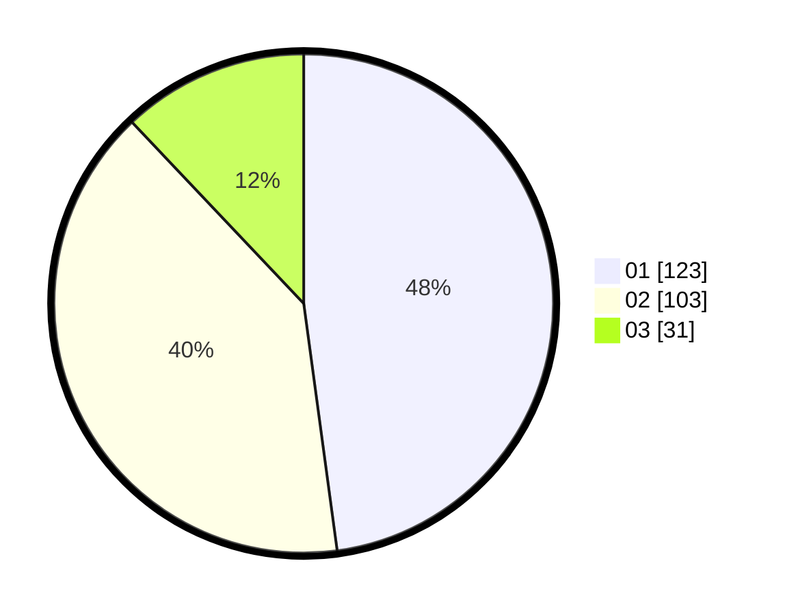

# Hasil

Hasil perolehan suara paslon dapat dilihat pada file paslon-01.txt, paslon-02.txt, dan paslon-03.txt.

Jika tidak ada, artinya data tersebut belum ada pada SIREKAP.

## Perolehan Suara

 * Paslon 01: **123**.
 * Paslon 02: **103**.
 * Paslon 03: **31**.

## Foto C Plano

https://sirekap-obj-formc.kpu.go.id/b1af/pemilu/ppwp/31/75/01/10/04/3175011004059-20240214-162210--42c9c826-0817-4711-a7fe-e29692a88743.jpg

https://sirekap-obj-formc.kpu.go.id/b1af/pemilu/ppwp/31/75/01/10/04/3175011004059-20240214-162225--9f137f4d-07f6-4413-9352-e3acee3b3701.jpg

https://sirekap-obj-formc.kpu.go.id/b1af/pemilu/ppwp/31/75/01/10/04/3175011004059-20240214-162231--0673831e-6115-469b-8f3c-8730d752be0b.jpg

## DATA PEMILIH TETAP

Jumlah pemilih dalam DPT: **298**.
 * L: **154**.
 * P: **144**.

## DATA PENGGUNA HAK PILIH

Jumlah pengguna hak pilih dalam DPT: **254**.
 * L: **126**.
 * P: **128**.

Jumlah pengguna hak pilih dalam DPTb: **6**.
 * L: **2**.
 * P: **4**.

Jumlah pengguna hak pilih dalam DPK: **2**.
 * L: **1**.
 * P: **1**.

Jumlah pengguna hak pilih: **262**.
 * L: **129**.
 * P: **133**.

## JUMLAH SUARA SAH DAN TIDAK SAH

JUMLAH SELURUH SUARA SAH: **257**.

JUMLAH SUARA TIDAK SAH: **5**.

JUMLAH SELURUH SUARA SAH DAN SUARA TIDAK SAH: **262**.
