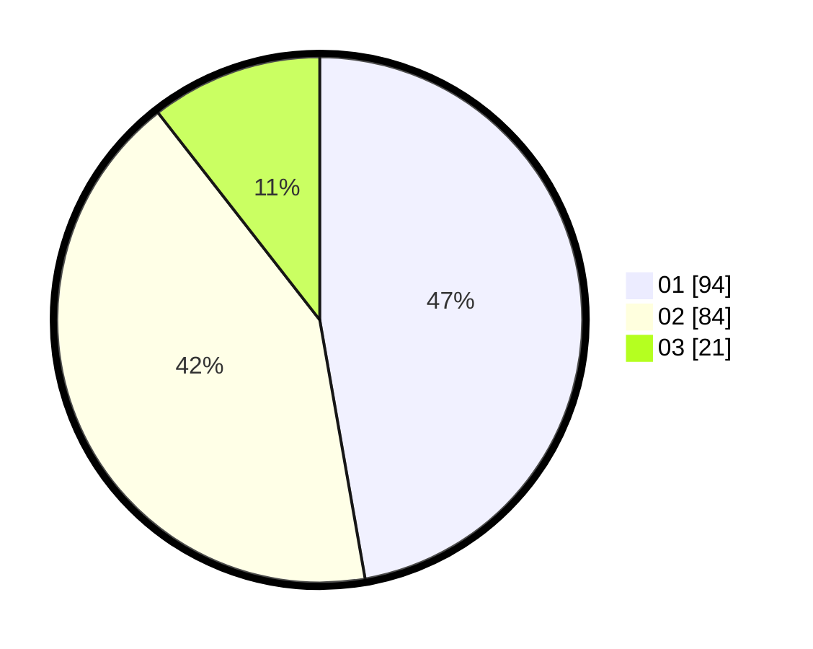

# Hasil

Hasil perolehan suara paslon dapat dilihat pada file paslon-01.txt, paslon-02.txt, dan paslon-03.txt.

Jika tidak ada, artinya data tersebut belum ada pada SIREKAP.

## Perolehan Suara

 * Paslon 01: **94**.
 * Paslon 02: **84**.
 * Paslon 03: **21**.

## Foto C Plano

https://sirekap-obj-formc.kpu.go.id/5f90/pemilu/ppwp/31/75/01/10/04/3175011004060-20240214-192708--0d625120-9747-40a2-8a9b-6ccf88b8bff7.jpg

https://sirekap-obj-formc.kpu.go.id/5f90/pemilu/ppwp/31/75/01/10/04/3175011004060-20240215-001312--445166e9-0247-4f60-9c6e-faa5ee7ad04a.jpg

https://sirekap-obj-formc.kpu.go.id/5f90/pemilu/ppwp/31/75/01/10/04/3175011004060-20240215-004407--a2d94477-57a4-4d96-82ca-8f4bfd29ad0c.jpg

## DATA PEMILIH TETAP

Jumlah pemilih dalam DPT: **286**.
 * L: **142**.
 * P: **144**.

## DATA PENGGUNA HAK PILIH

Jumlah pengguna hak pilih dalam DPT: **199**.
 * L: **94**.
 * P: **105**.

Jumlah pengguna hak pilih dalam DPTb: **3**.
 * L: **2**.
 * P: **1**.

Jumlah pengguna hak pilih dalam DPK: **1**.
 * L: **1**.
 * P: **0**.

Jumlah pengguna hak pilih: **203**.
 * L: **97**.
 * P: **106**.

## JUMLAH SUARA SAH DAN TIDAK SAH

JUMLAH SELURUH SUARA SAH: **199**.

JUMLAH SUARA TIDAK SAH: **4**.

JUMLAH SELURUH SUARA SAH DAN SUARA TIDAK SAH: **203**.
