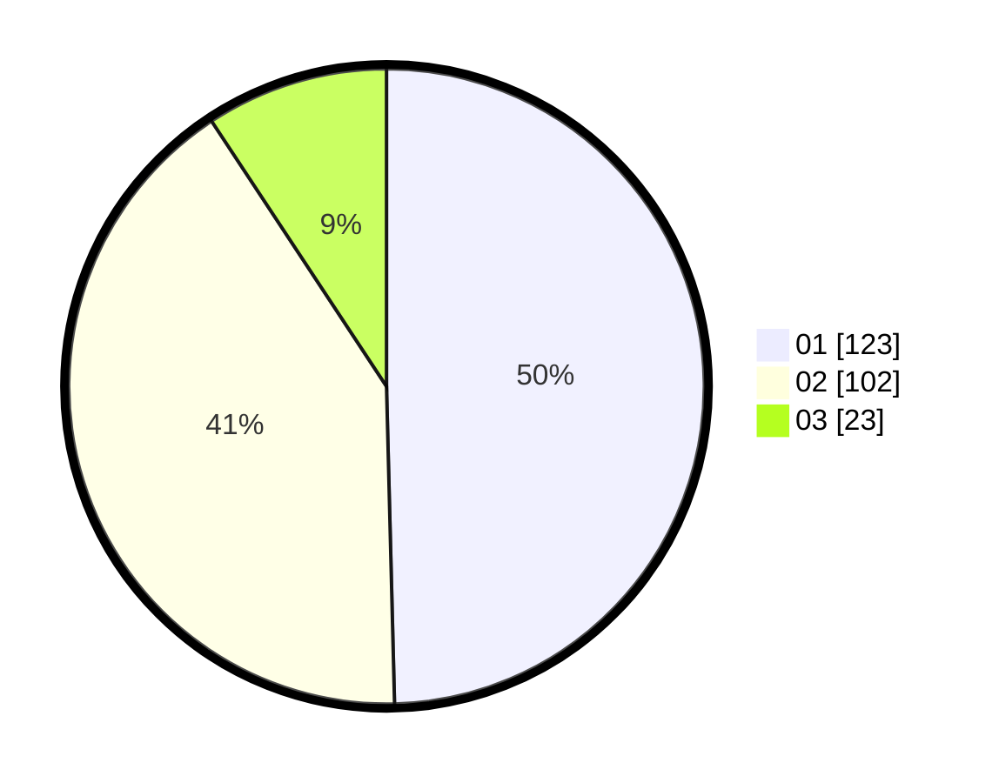

# Hasil

Hasil perolehan suara paslon dapat dilihat pada file paslon-01.txt, paslon-02.txt, dan paslon-03.txt.

Jika tidak ada, artinya data tersebut belum ada pada SIREKAP.

## Perolehan Suara

 * Paslon 01: **123**.
 * Paslon 02: **102**.
 * Paslon 03: **23**.

## Foto C Plano

https://sirekap-obj-formc.kpu.go.id/06fb/pemilu/ppwp/31/75/01/10/04/3175011004063-20240215-035316--3026f66c-2ad6-4d8a-a355-957a73335a76.jpg

https://sirekap-obj-formc.kpu.go.id/06fb/pemilu/ppwp/31/75/01/10/04/3175011004063-20240215-035447--fa0fee93-07a7-4f9a-ace6-b68432115f17.jpg

https://sirekap-obj-formc.kpu.go.id/06fb/pemilu/ppwp/31/75/01/10/04/3175011004063-20240215-035626--11acdf37-1345-4db7-8819-b94f7c441ead.jpg

## DATA PEMILIH TETAP

Jumlah pemilih dalam DPT: **296**.
 * L: **133**.
 * P: **163**.

## DATA PENGGUNA HAK PILIH

Jumlah pengguna hak pilih dalam DPT: **242**.
 * L: **105**.
 * P: **137**.

Jumlah pengguna hak pilih dalam DPTb: **5**.
 * L: **1**.
 * P: **4**.

Jumlah pengguna hak pilih dalam DPK: **2**.
 * L: **1**.
 * P: **1**.

Jumlah pengguna hak pilih: **249**.
 * L: **107**.
 * P: **142**.

## JUMLAH SUARA SAH DAN TIDAK SAH

JUMLAH SELURUH SUARA SAH: **248**.

JUMLAH SUARA TIDAK SAH: **1**.

JUMLAH SELURUH SUARA SAH DAN SUARA TIDAK SAH: **249**.
