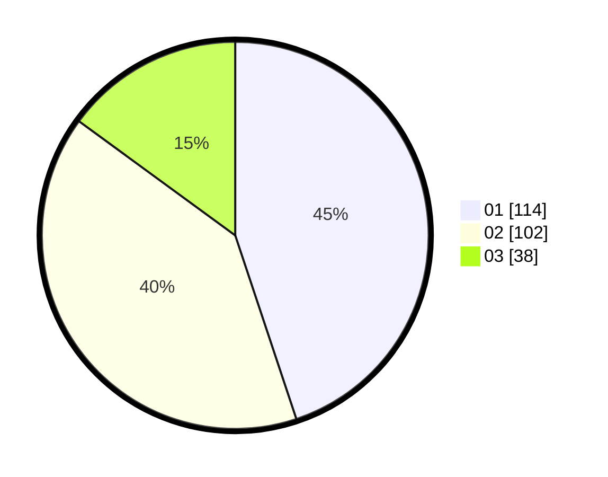

# Hasil

Hasil perolehan suara paslon dapat dilihat pada file paslon-01.txt, paslon-02.txt, dan paslon-03.txt.

Jika tidak ada, artinya data tersebut belum ada pada SIREKAP.

## Perolehan Suara

 * Paslon 01: **114**.
 * Paslon 02: **102**.
 * Paslon 03: **38**.

## Foto C Plano

https://sirekap-obj-formc.kpu.go.id/0e6e/pemilu/ppwp/31/75/01/10/04/3175011004064-20240215-231908--668c483f-c4db-4538-bb9b-2e50298c1eb4.jpg

https://sirekap-obj-formc.kpu.go.id/0e6e/pemilu/ppwp/31/75/01/10/04/3175011004064-20240215-231912--58a4ee04-a73c-4d09-8561-c2aefd358e2b.jpg

https://sirekap-obj-formc.kpu.go.id/0e6e/pemilu/ppwp/31/75/01/10/04/3175011004064-20240215-231909--0f332da7-7684-4c76-9127-03e8e4fbf874.jpg

## DATA PEMILIH TETAP

Jumlah pemilih dalam DPT: **298**.
 * L: **146**.
 * P: **152**.

## DATA PENGGUNA HAK PILIH

Jumlah pengguna hak pilih dalam DPT: **251**.
 * L: **120**.
 * P: **131**.

Jumlah pengguna hak pilih dalam DPTb: **4**.
 * L: **0**.
 * P: **4**.

Jumlah pengguna hak pilih dalam DPK: **2**.
 * L: **0**.
 * P: **2**.

Jumlah pengguna hak pilih: **257**.
 * L: **120**.
 * P: **137**.

## JUMLAH SUARA SAH DAN TIDAK SAH

JUMLAH SELURUH SUARA SAH: **254**.

JUMLAH SUARA TIDAK SAH: **3**.

JUMLAH SELURUH SUARA SAH DAN SUARA TIDAK SAH: **257**.
