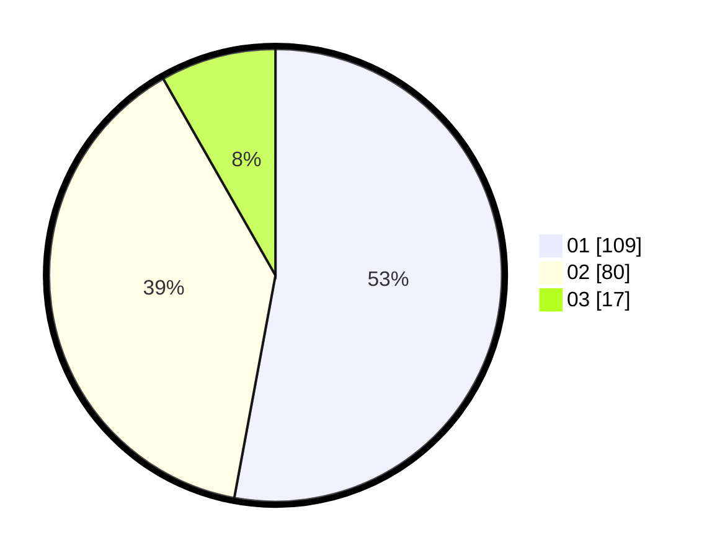

# Hasil

Hasil perolehan suara paslon dapat dilihat pada file paslon-01.txt, paslon-02.txt, dan paslon-03.txt.

Jika tidak ada, artinya data tersebut belum ada pada SIREKAP.

## Perolehan Suara

 * Paslon 01: **109**.
 * Paslon 02: **80**.
 * Paslon 03: **17**.

## Foto C Plano

https://sirekap-obj-formc.kpu.go.id/1f9d/pemilu/ppwp/31/75/01/10/05/3175011005002-20240216-160826--4f7e1ce5-7d08-406b-8874-d08f3034269f.jpg

https://sirekap-obj-formc.kpu.go.id/1f9d/pemilu/ppwp/31/75/01/10/05/3175011005002-20240216-160416--e840645b-0bdf-44f3-8511-681ed15de644.jpg

https://sirekap-obj-formc.kpu.go.id/1f9d/pemilu/ppwp/31/75/01/10/05/3175011005002-20240216-160457--522301e7-3178-4b32-8045-b3c2d0488388.jpg
