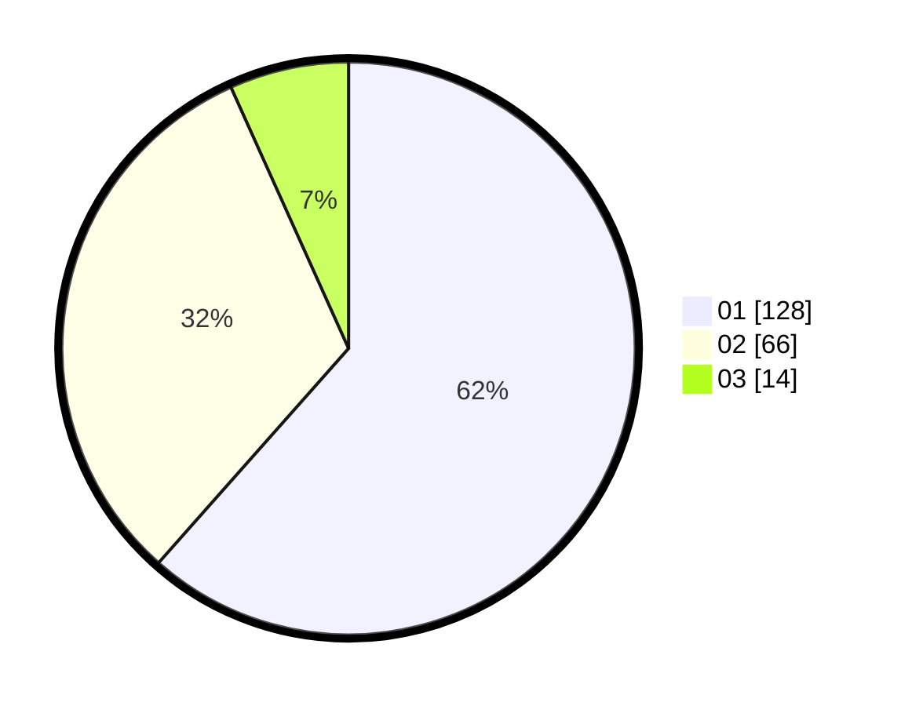

# Hasil

Hasil perolehan suara paslon dapat dilihat pada file paslon-01.txt, paslon-02.txt, dan paslon-03.txt.

Jika tidak ada, artinya data tersebut belum ada pada SIREKAP.

## Perolehan Suara

 * Paslon 01: **128**.
 * Paslon 02: **66**.
 * Paslon 03: **14**.

## Foto C Plano

https://sirekap-obj-formc.kpu.go.id/9919/pemilu/ppwp/31/75/01/10/05/3175011005003-20240214-234414--0290c950-2d10-4fb3-8215-fdd53f3e7088.jpg

https://sirekap-obj-formc.kpu.go.id/9919/pemilu/ppwp/31/75/01/10/05/3175011005003-20240214-234453--320e23d7-683f-4df7-b5d1-dbeea816c149.jpg

https://sirekap-obj-formc.kpu.go.id/9919/pemilu/ppwp/31/75/01/10/05/3175011005003-20240214-234542--3a76b85e-e028-4a1c-914a-5c5d49444971.jpg
