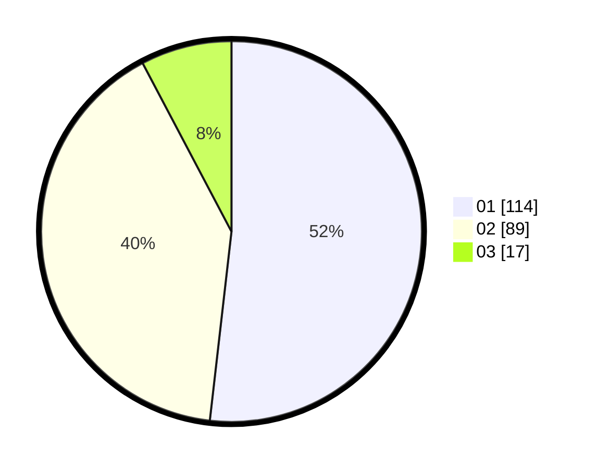

# Hasil

Hasil perolehan suara paslon dapat dilihat pada file paslon-01.txt, paslon-02.txt, dan paslon-03.txt.

Jika tidak ada, artinya data tersebut belum ada pada SIREKAP.

## Perolehan Suara

 * Paslon 01: **114**.
 * Paslon 02: **89**.
 * Paslon 03: **17**.

## Foto C Plano

https://sirekap-obj-formc.kpu.go.id/4b51/pemilu/ppwp/31/75/01/10/05/3175011005006-20240214-201007--32c7bc94-d9cf-483f-896e-56048570c2b6.jpg

https://sirekap-obj-formc.kpu.go.id/4b51/pemilu/ppwp/31/75/01/10/05/3175011005006-20240214-224603--a7727f03-8c42-4230-afc8-a01916ea2284.jpg

https://sirekap-obj-formc.kpu.go.id/4b51/pemilu/ppwp/31/75/01/10/05/3175011005006-20240214-224724--62657a57-66c6-4d87-98a1-d7a95719764d.jpg
