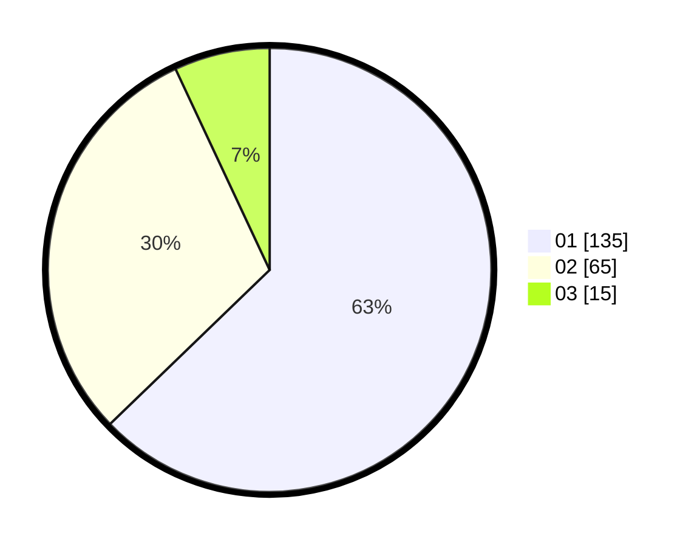

# Hasil

Hasil perolehan suara paslon dapat dilihat pada file paslon-01.txt, paslon-02.txt, dan paslon-03.txt.

Jika tidak ada, artinya data tersebut belum ada pada SIREKAP.

## Perolehan Suara

 * Paslon 01: **135**.
 * Paslon 02: **65**.
 * Paslon 03: **15**.

## Foto C Plano

https://sirekap-obj-formc.kpu.go.id/81a2/pemilu/ppwp/31/75/01/10/05/3175011005010-20240214-195223--b07d59ca-dba6-4e72-ae1b-3de0d0b90531.jpg

https://sirekap-obj-formc.kpu.go.id/81a2/pemilu/ppwp/31/75/01/10/05/3175011005010-20240214-201025--7b955e06-8222-4c9f-a243-c6addc03e0ff.jpg

https://sirekap-obj-formc.kpu.go.id/81a2/pemilu/ppwp/31/75/01/10/05/3175011005010-20240214-204118--a467bda9-fe38-4f90-bf35-1c7425cfa444.jpg
