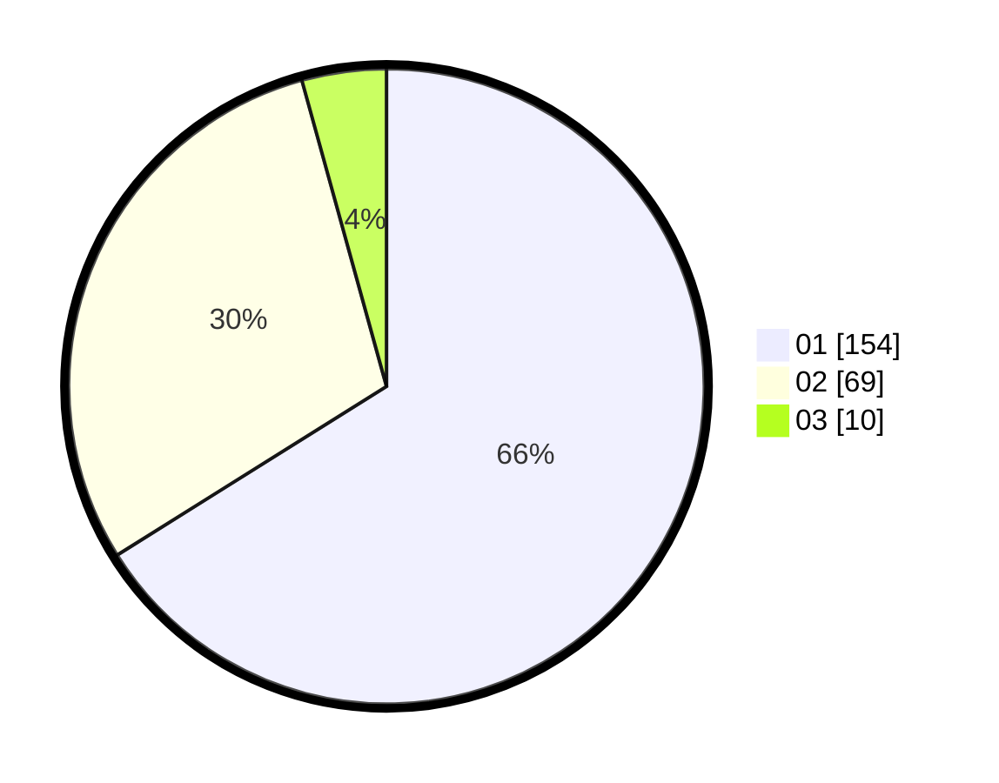

# Hasil

Hasil perolehan suara paslon dapat dilihat pada file paslon-01.txt, paslon-02.txt, dan paslon-03.txt.

Jika tidak ada, artinya data tersebut belum ada pada SIREKAP.

## Perolehan Suara

 * Paslon 01: **154**.
 * Paslon 02: **69**.
 * Paslon 03: **10**.

## Foto C Plano

https://sirekap-obj-formc.kpu.go.id/4c11/pemilu/ppwp/31/75/01/10/05/3175011005014-20240215-013801--73ef6f48-0c32-483b-8da9-90918991ceee.jpg

https://sirekap-obj-formc.kpu.go.id/4c11/pemilu/ppwp/31/75/01/10/05/3175011005014-20240215-013842--19b034de-f59d-466e-8eaa-ad89e8a4d55b.jpg

https://sirekap-obj-formc.kpu.go.id/4c11/pemilu/ppwp/31/75/01/10/05/3175011005014-20240215-013924--0a008b21-b3c5-49b7-9229-7e60a1062617.jpg
