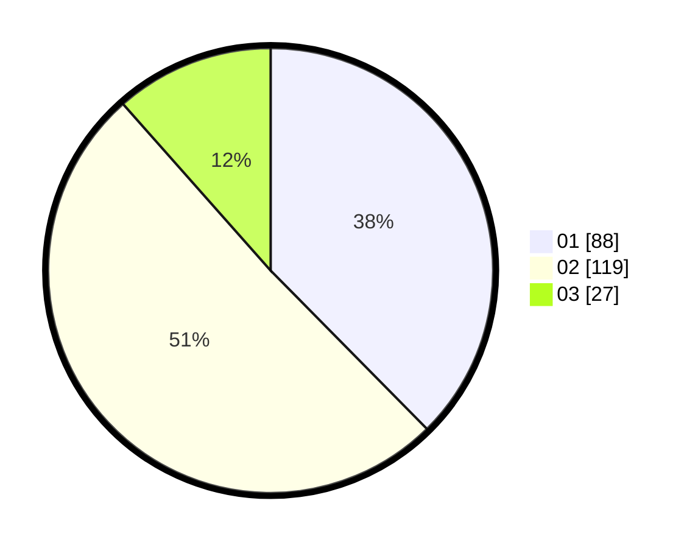

# Hasil

Hasil perolehan suara paslon dapat dilihat pada file paslon-01.txt, paslon-02.txt, dan paslon-03.txt.

Jika tidak ada, artinya data tersebut belum ada pada SIREKAP.

## Perolehan Suara

 * Paslon 01: **88**.
 * Paslon 02: **119**.
 * Paslon 03: **27**.

## Foto C Plano

https://sirekap-obj-formc.kpu.go.id/907d/pemilu/ppwp/31/75/01/10/05/3175011005024-20240216-133630--a88ff425-9139-4978-b5c2-69397eab36cd.jpg

https://sirekap-obj-formc.kpu.go.id/907d/pemilu/ppwp/31/75/01/10/05/3175011005024-20240216-161034--69a0e6dd-1284-463d-944c-94ae86cafd94.jpg

https://sirekap-obj-formc.kpu.go.id/907d/pemilu/ppwp/31/75/01/10/05/3175011005024-20240216-162846--6f08eb42-180e-4abd-8350-912905e85881.jpg

## DATA PEMILIH TETAP

Jumlah pemilih dalam DPT: **280**.
 * L: **134**.
 * P: **146**.

## DATA PENGGUNA HAK PILIH

Jumlah pengguna hak pilih dalam DPT: **234**.
 * L: **106**.
 * P: **128**.

Jumlah pengguna hak pilih dalam DPTb: **2**.
 * L: **2**.
 * P: **0**.

Jumlah pengguna hak pilih dalam DPK: **1**.
 * L: **0**.
 * P: **1**.

Jumlah pengguna hak pilih: **237**.
 * L: **108**.
 * P: **129**.

## JUMLAH SUARA SAH DAN TIDAK SAH

JUMLAH SELURUH SUARA SAH: **234**.

JUMLAH SUARA TIDAK SAH: **4**.

JUMLAH SELURUH SUARA SAH DAN SUARA TIDAK SAH: **238**.
