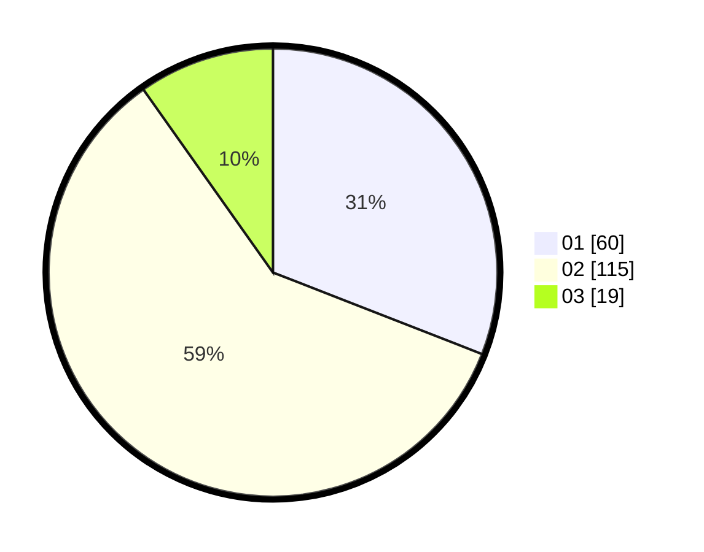

# Hasil

Hasil perolehan suara paslon dapat dilihat pada file paslon-01.txt, paslon-02.txt, dan paslon-03.txt.

Jika tidak ada, artinya data tersebut belum ada pada SIREKAP.

## Perolehan Suara

 * Paslon 01: **60**.
 * Paslon 02: **115**.
 * Paslon 03: **19**.

## Foto C Plano

https://sirekap-obj-formc.kpu.go.id/a141/pemilu/ppwp/31/75/01/10/05/3175011005025-20240214-215715--6f25b027-4622-4430-932b-40a7153593c0.jpg

https://sirekap-obj-formc.kpu.go.id/a141/pemilu/ppwp/31/75/01/10/05/3175011005025-20240215-023424--cf2cad3c-f5fc-4d0a-8781-ca11fabcb6ce.jpg

https://sirekap-obj-formc.kpu.go.id/a141/pemilu/ppwp/31/75/01/10/05/3175011005025-20240214-215328--7797469b-30d9-465d-b1df-6255ce839516.jpg
