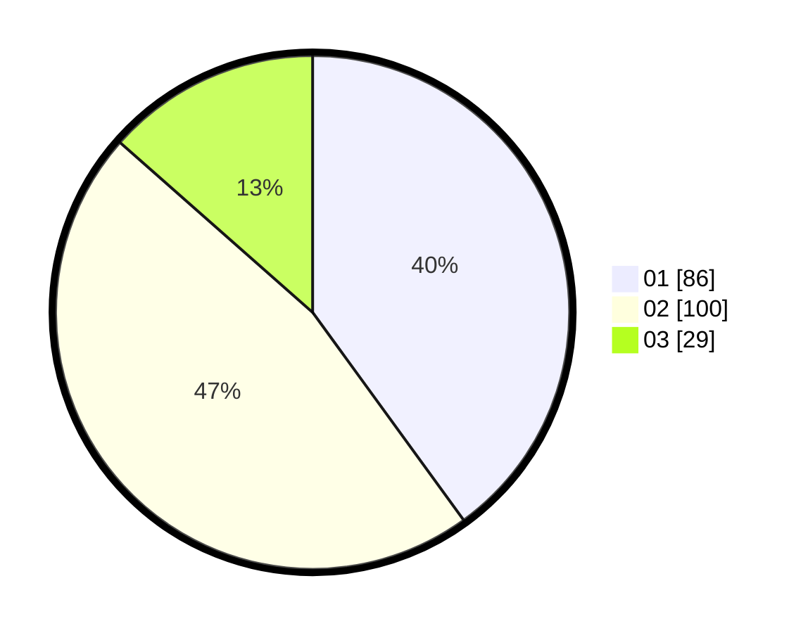

# Hasil

Hasil perolehan suara paslon dapat dilihat pada file paslon-01.txt, paslon-02.txt, dan paslon-03.txt.

Jika tidak ada, artinya data tersebut belum ada pada SIREKAP.

## Perolehan Suara

 * Paslon 01: **86**.
 * Paslon 02: **100**.
 * Paslon 03: **29**.

## Foto C Plano

https://sirekap-obj-formc.kpu.go.id/2a0e/pemilu/ppwp/31/75/01/10/05/3175011005032-20240214-214343--cfbd2e3e-d5f0-4c05-a691-52ab3daa99ae.jpg

https://sirekap-obj-formc.kpu.go.id/2a0e/pemilu/ppwp/31/75/01/10/05/3175011005032-20240214-214550--76dd6577-cb53-4e33-a0fa-73a252ee2927.jpg

https://sirekap-obj-formc.kpu.go.id/2a0e/pemilu/ppwp/31/75/01/10/05/3175011005032-20240214-214747--69d84cad-6e85-47b1-b277-e013c045893c.jpg
