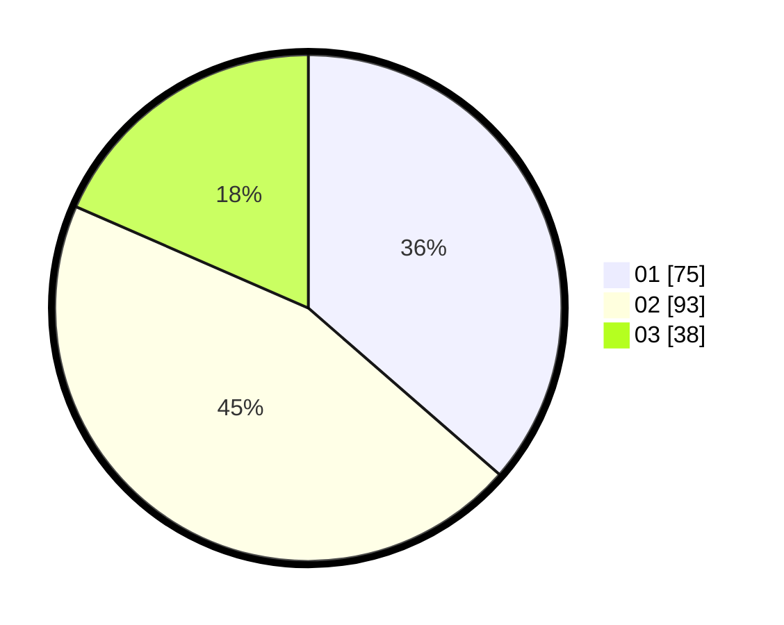

# Hasil

Hasil perolehan suara paslon dapat dilihat pada file paslon-01.txt, paslon-02.txt, dan paslon-03.txt.

Jika tidak ada, artinya data tersebut belum ada pada SIREKAP.

## Perolehan Suara

 * Paslon 01: **75**.
 * Paslon 02: **93**.
 * Paslon 03: **38**.

## Foto C Plano

https://sirekap-obj-formc.kpu.go.id/e6c6/pemilu/ppwp/31/75/01/10/05/3175011005036-20240214-204721--81cf158b-c5d0-4934-956a-ae46aff9be2d.jpg

https://sirekap-obj-formc.kpu.go.id/e6c6/pemilu/ppwp/31/75/01/10/05/3175011005036-20240214-220959--7bcc1bde-8b3e-477c-80e0-a44a5553a852.jpg

https://sirekap-obj-formc.kpu.go.id/e6c6/pemilu/ppwp/31/75/01/10/05/3175011005036-20240214-205010--8bfe0adf-2c2f-49b8-ad58-e28959a8a0c4.jpg
