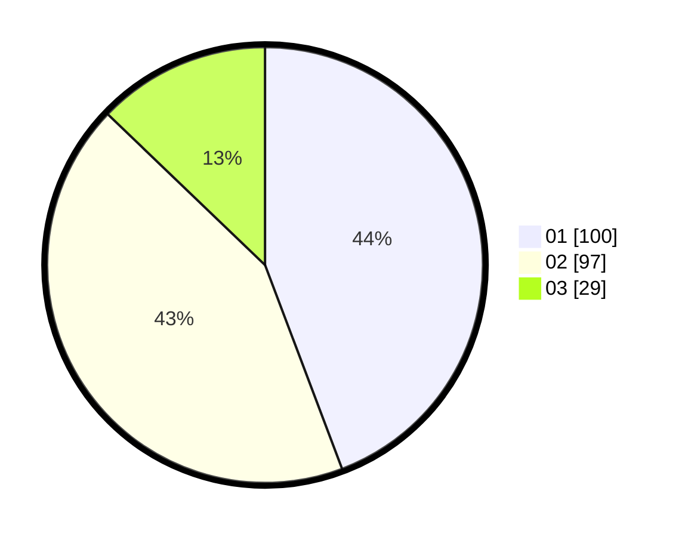

# Hasil

Hasil perolehan suara paslon dapat dilihat pada file paslon-01.txt, paslon-02.txt, dan paslon-03.txt.

Jika tidak ada, artinya data tersebut belum ada pada SIREKAP.

## Perolehan Suara

 * Paslon 01: **100**.
 * Paslon 02: **97**.
 * Paslon 03: **29**.

## Foto C Plano

https://sirekap-obj-formc.kpu.go.id/831f/pemilu/ppwp/31/75/01/10/05/3175011005039-20240214-155138--72343ffc-cabf-4a20-a07b-82f594a73df8.jpg

https://sirekap-obj-formc.kpu.go.id/831f/pemilu/ppwp/31/75/01/10/05/3175011005039-20240216-144324--fb1449a5-2d34-45a4-a7d3-b4955941ca71.jpg

https://sirekap-obj-formc.kpu.go.id/831f/pemilu/ppwp/31/75/01/10/05/3175011005039-20240214-155341--f4431307-b7d7-45dc-9538-44c3a2a2d55f.jpg

## DATA PEMILIH TETAP

Jumlah pemilih dalam DPT: **281**.
 * L: **135**.
 * P: **146**.

## DATA PENGGUNA HAK PILIH

Jumlah pengguna hak pilih dalam DPT: **227**.
 * L: **108**.
 * P: **119**.

Jumlah pengguna hak pilih dalam DPTb: **1**.
 * L: **1**.
 * P: **0**.

Jumlah pengguna hak pilih dalam DPK: **4**.
 * L: **1**.
 * P: **3**.

Jumlah pengguna hak pilih: **232**.
 * L: **110**.
 * P: **122**.

## JUMLAH SUARA SAH DAN TIDAK SAH

JUMLAH SELURUH SUARA SAH: **226**.

JUMLAH SUARA TIDAK SAH: **6**.

JUMLAH SELURUH SUARA SAH DAN SUARA TIDAK SAH: **232**.
