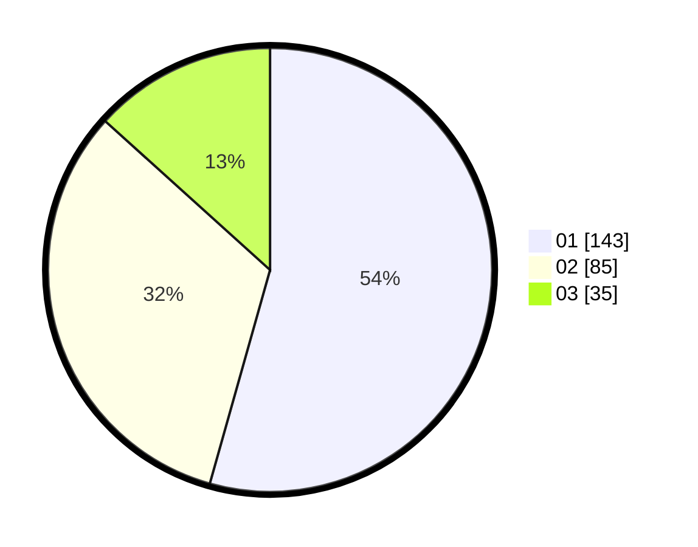

# Hasil

Hasil perolehan suara paslon dapat dilihat pada file paslon-01.txt, paslon-02.txt, dan paslon-03.txt.

Jika tidak ada, artinya data tersebut belum ada pada SIREKAP.

## Perolehan Suara

 * Paslon 01: **143**.
 * Paslon 02: **85**.
 * Paslon 03: **35**.

## Foto C Plano

https://sirekap-obj-formc.kpu.go.id/2185/pemilu/ppwp/31/75/01/10/05/3175011005043-20240214-155221--be30a70c-e35d-430f-8e43-38b9e8265a1a.jpg

https://sirekap-obj-formc.kpu.go.id/2185/pemilu/ppwp/31/75/01/10/05/3175011005043-20240214-155819--6deb1036-094b-4a9c-932c-97640e44b3a7.jpg

https://sirekap-obj-formc.kpu.go.id/2185/pemilu/ppwp/31/75/01/10/05/3175011005043-20240214-155131--02ad6b3f-2d0c-4c5c-a0f8-9539768c8d0d.jpg

## DATA PEMILIH TETAP

Jumlah pemilih dalam DPT: **287**.
 * L: **134**.
 * P: **153**.

## DATA PENGGUNA HAK PILIH

Jumlah pengguna hak pilih dalam DPT: **254**.
 * L: **118**.
 * P: **136**.

Jumlah pengguna hak pilih dalam DPTb: **3**.
 * L: **0**.
 * P: **3**.

Jumlah pengguna hak pilih dalam DPK: **8**.
 * L: **6**.
 * P: **2**.

Jumlah pengguna hak pilih: **265**.
 * L: **124**.
 * P: **141**.

## JUMLAH SUARA SAH DAN TIDAK SAH

JUMLAH SELURUH SUARA SAH: **263**.

JUMLAH SUARA TIDAK SAH: **2**.

JUMLAH SELURUH SUARA SAH DAN SUARA TIDAK SAH: **265**.
