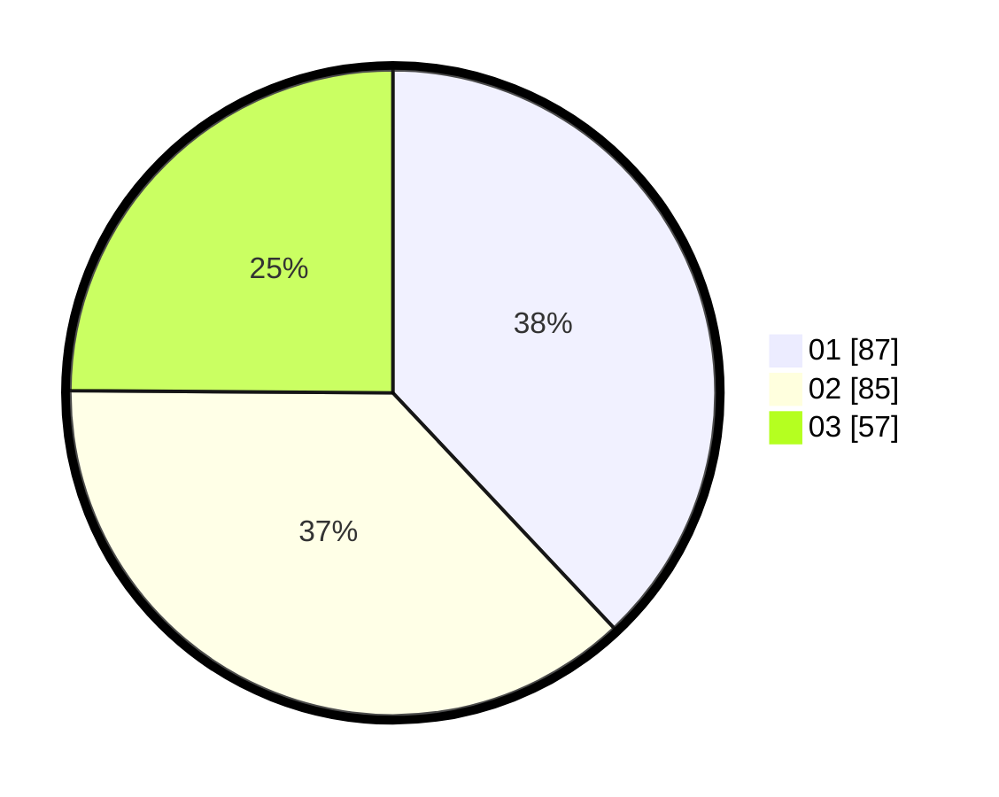

# Hasil

Hasil perolehan suara paslon dapat dilihat pada file paslon-01.txt, paslon-02.txt, dan paslon-03.txt.

Jika tidak ada, artinya data tersebut belum ada pada SIREKAP.

## Perolehan Suara

 * Paslon 01: **87**.
 * Paslon 02: **85**.
 * Paslon 03: **57**.

## Foto C Plano

https://sirekap-obj-formc.kpu.go.id/6bf8/pemilu/ppwp/31/75/01/10/05/3175011005045-20240214-203441--82575daa-d02a-4037-92c5-98f0c25840ca.jpg

https://sirekap-obj-formc.kpu.go.id/6bf8/pemilu/ppwp/31/75/01/10/05/3175011005045-20240214-203636--bff446d6-7167-4516-bbf9-6429b6f7a2b1.jpg

https://sirekap-obj-formc.kpu.go.id/6bf8/pemilu/ppwp/31/75/01/10/05/3175011005045-20240214-203627--ddf39213-6d14-40cf-abc9-89226b0c6e27.jpg

## DATA PEMILIH TETAP

Jumlah pemilih dalam DPT: **288**.
 * L: **130**.
 * P: **158**.

## DATA PENGGUNA HAK PILIH

Jumlah pengguna hak pilih dalam DPT: **234**.
 * L: **99**.
 * P: **135**.

Jumlah pengguna hak pilih dalam DPTb: **2**.
 * L: **2**.
 * P: **0**.

Jumlah pengguna hak pilih dalam DPK: **3**.
 * L: **3**.
 * P: **0**.

Jumlah pengguna hak pilih: **239**.
 * L: **104**.
 * P: **135**.

## JUMLAH SUARA SAH DAN TIDAK SAH

JUMLAH SELURUH SUARA SAH: **229**.

JUMLAH SUARA TIDAK SAH: **10**.

JUMLAH SELURUH SUARA SAH DAN SUARA TIDAK SAH: **239**.
