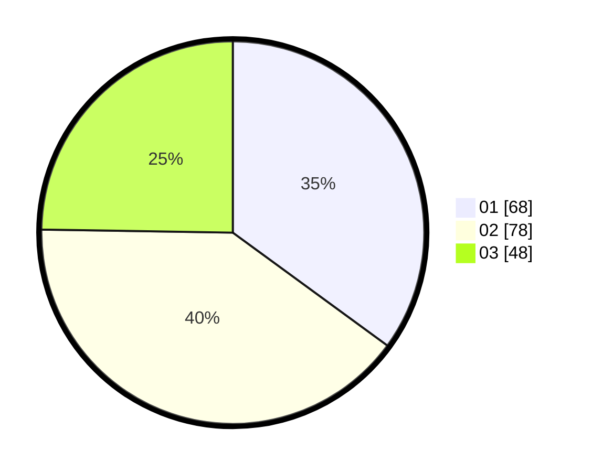

# Hasil

Hasil perolehan suara paslon dapat dilihat pada file paslon-01.txt, paslon-02.txt, dan paslon-03.txt.

Jika tidak ada, artinya data tersebut belum ada pada SIREKAP.

## Perolehan Suara

 * Paslon 01: **68**.
 * Paslon 02: **78**.
 * Paslon 03: **48**.

## Foto C Plano

https://sirekap-obj-formc.kpu.go.id/befa/pemilu/ppwp/31/75/01/10/05/3175011005048-20240214-220656--da0b07ca-7219-421e-80a8-86472de26dd3.jpg

https://sirekap-obj-formc.kpu.go.id/befa/pemilu/ppwp/31/75/01/10/05/3175011005048-20240214-220859--e320d462-13b2-45ca-963e-2d695cf7fbae.jpg

https://sirekap-obj-formc.kpu.go.id/befa/pemilu/ppwp/31/75/01/10/05/3175011005048-20240214-200350--ea50ee6e-f103-4305-911a-764fc0e09231.jpg
