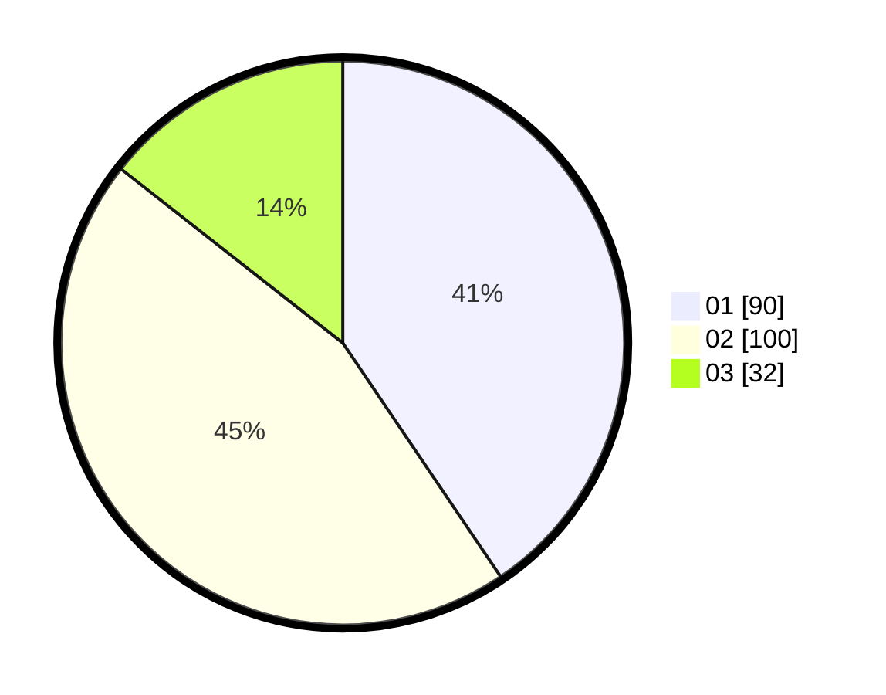

# Hasil

Hasil perolehan suara paslon dapat dilihat pada file paslon-01.txt, paslon-02.txt, dan paslon-03.txt.

Jika tidak ada, artinya data tersebut belum ada pada SIREKAP.

## Perolehan Suara

 * Paslon 01: **90**.
 * Paslon 02: **100**.
 * Paslon 03: **32**.

## Foto C Plano

https://sirekap-obj-formc.kpu.go.id/2073/pemilu/ppwp/31/75/01/10/05/3175011005050-20240216-041741--1c15811f-88e1-4d33-8c83-0a1bcf8212d8.jpg

https://sirekap-obj-formc.kpu.go.id/2073/pemilu/ppwp/31/75/01/10/05/3175011005050-20240216-041757--605dfcef-dedd-485b-af2f-57243170c6e3.jpg

https://sirekap-obj-formc.kpu.go.id/2073/pemilu/ppwp/31/75/01/10/05/3175011005050-20240216-041753--83555b97-5577-4088-b873-c71681bfaaaa.jpg

## DATA PEMILIH TETAP

Jumlah pemilih dalam DPT: **264**.
 * L: **135**.
 * P: **129**.

## DATA PENGGUNA HAK PILIH

Jumlah pengguna hak pilih dalam DPT: **211**.
 * L: **106**.
 * P: **105**.

Jumlah pengguna hak pilih dalam DPTb: **11**.
 * L: **8**.
 * P: **3**.

Jumlah pengguna hak pilih dalam DPK: **1**.
 * L: **0**.
 * P: **1**.

Jumlah pengguna hak pilih: **223**.
 * L: **114**.
 * P: **109**.

## JUMLAH SUARA SAH DAN TIDAK SAH

JUMLAH SELURUH SUARA SAH: **222**.

JUMLAH SUARA TIDAK SAH: **1**.

JUMLAH SELURUH SUARA SAH DAN SUARA TIDAK SAH: **223**.
