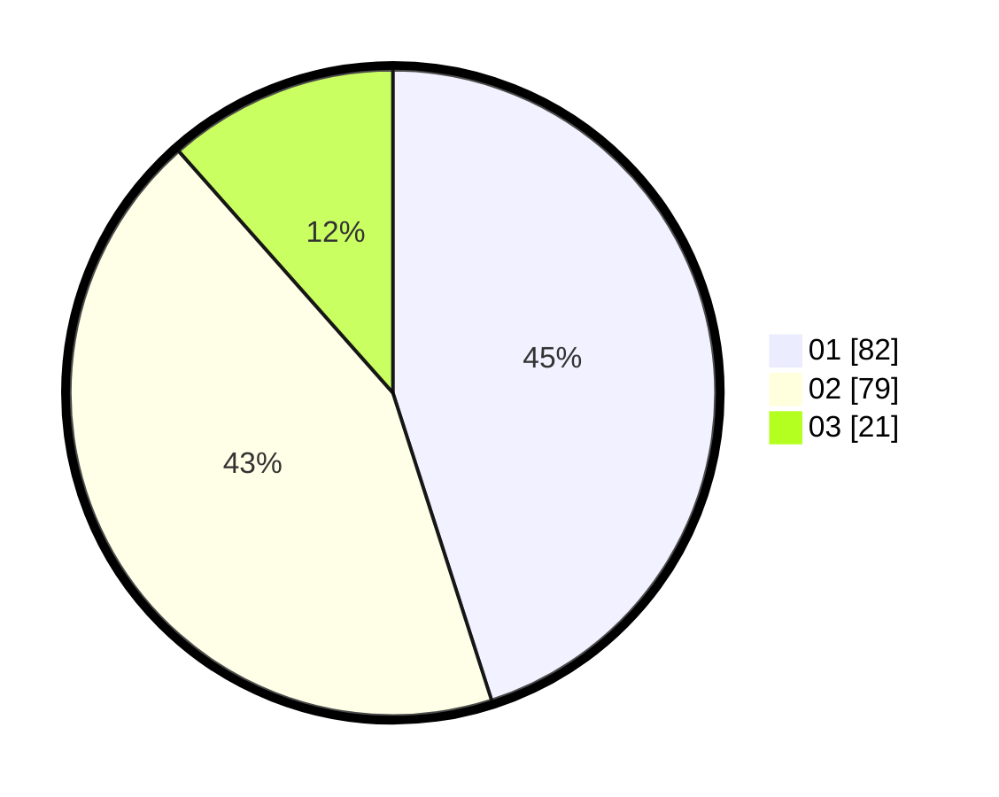

# Hasil

Hasil perolehan suara paslon dapat dilihat pada file paslon-01.txt, paslon-02.txt, dan paslon-03.txt.

Jika tidak ada, artinya data tersebut belum ada pada SIREKAP.

## Perolehan Suara

 * Paslon 01: **82**.
 * Paslon 02: **79**.
 * Paslon 03: **21**.

## Foto C Plano

https://sirekap-obj-formc.kpu.go.id/808a/pemilu/ppwp/31/75/01/10/05/3175011005052-20240216-182849--229e1273-64da-4e6e-82cd-b9b91ff6a276.jpg

https://sirekap-obj-formc.kpu.go.id/808a/pemilu/ppwp/31/75/01/10/05/3175011005052-20240216-190519--eace6c7c-4e41-4c75-a296-cb48c719c2c6.jpg

https://sirekap-obj-formc.kpu.go.id/808a/pemilu/ppwp/31/75/01/10/05/3175011005052-20240216-190806--b4fb37e0-4489-445d-bc23-401046def4e0.jpg

## DATA PEMILIH TETAP

Jumlah pemilih dalam DPT: **184**.
 * L: **93**.
 * P: **91**.

## DATA PENGGUNA HAK PILIH

Jumlah pengguna hak pilih dalam DPT: **259**.
 * L: **130**.
 * P: **129**.

Jumlah pengguna hak pilih dalam DPTb: **0**.
 * L: **0**.
 * P: **0**.

Jumlah pengguna hak pilih dalam DPK: **0**.
 * L: **0**.
 * P: **0**.

Jumlah pengguna hak pilih: **259**.
 * L: **130**.
 * P: **129**.

## JUMLAH SUARA SAH DAN TIDAK SAH

JUMLAH SELURUH SUARA SAH: **182**.

JUMLAH SUARA TIDAK SAH: **2**.

JUMLAH SELURUH SUARA SAH DAN SUARA TIDAK SAH: **184**.
