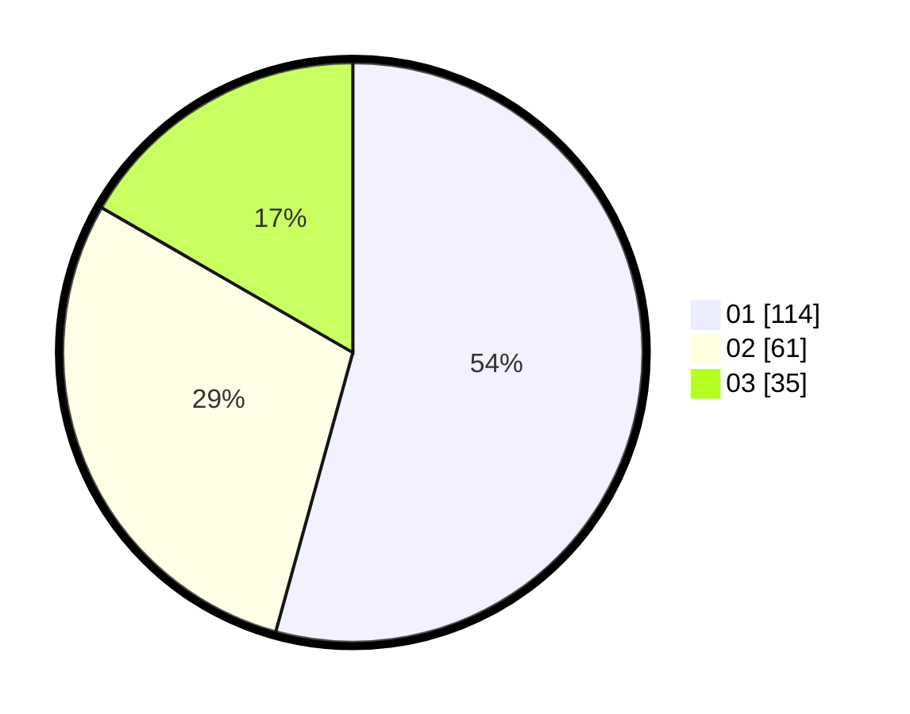

# Hasil

Hasil perolehan suara paslon dapat dilihat pada file paslon-01.txt, paslon-02.txt, dan paslon-03.txt.

Jika tidak ada, artinya data tersebut belum ada pada SIREKAP.

## Perolehan Suara

 * Paslon 01: **114**.
 * Paslon 02: **61**.
 * Paslon 03: **35**.

## Foto C Plano

https://sirekap-obj-formc.kpu.go.id/6623/pemilu/ppwp/31/75/01/10/06/3175011006001-20240216-145509--ea9e1b16-3120-46da-93cb-5c18fd59a5eb.jpg

https://sirekap-obj-formc.kpu.go.id/6623/pemilu/ppwp/31/75/01/10/06/3175011006001-20240216-145739--acc6ca12-5f44-406b-8f08-207091a3a624.jpg

https://sirekap-obj-formc.kpu.go.id/6623/pemilu/ppwp/31/75/01/10/06/3175011006001-20240216-145914--7b225d0b-2271-45b9-aa75-cdd0cfbc528a.jpg
