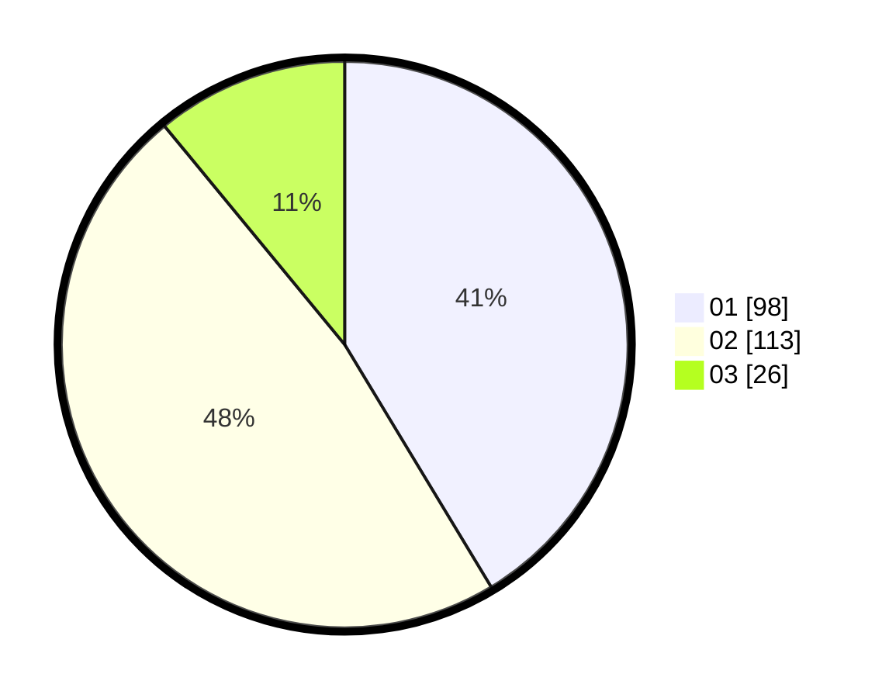

# Hasil

Hasil perolehan suara paslon dapat dilihat pada file paslon-01.txt, paslon-02.txt, dan paslon-03.txt.

Jika tidak ada, artinya data tersebut belum ada pada SIREKAP.

## Perolehan Suara

 * Paslon 01: **98**.
 * Paslon 02: **113**.
 * Paslon 03: **26**.

## Foto C Plano

https://sirekap-obj-formc.kpu.go.id/8691/pemilu/ppwp/31/75/01/10/06/3175011006009-20240214-214307--cf58ba2c-39b8-4f8d-9d06-074658f5fd81.jpg

https://sirekap-obj-formc.kpu.go.id/8691/pemilu/ppwp/31/75/01/10/06/3175011006009-20240214-214407--49ae5a95-b8b8-4af2-a3fc-a4d6bfcbe71a.jpg

https://sirekap-obj-formc.kpu.go.id/8691/pemilu/ppwp/31/75/01/10/06/3175011006009-20240214-214458--4ad69a30-a2fb-40a3-9358-83ce65e74cc1.jpg
