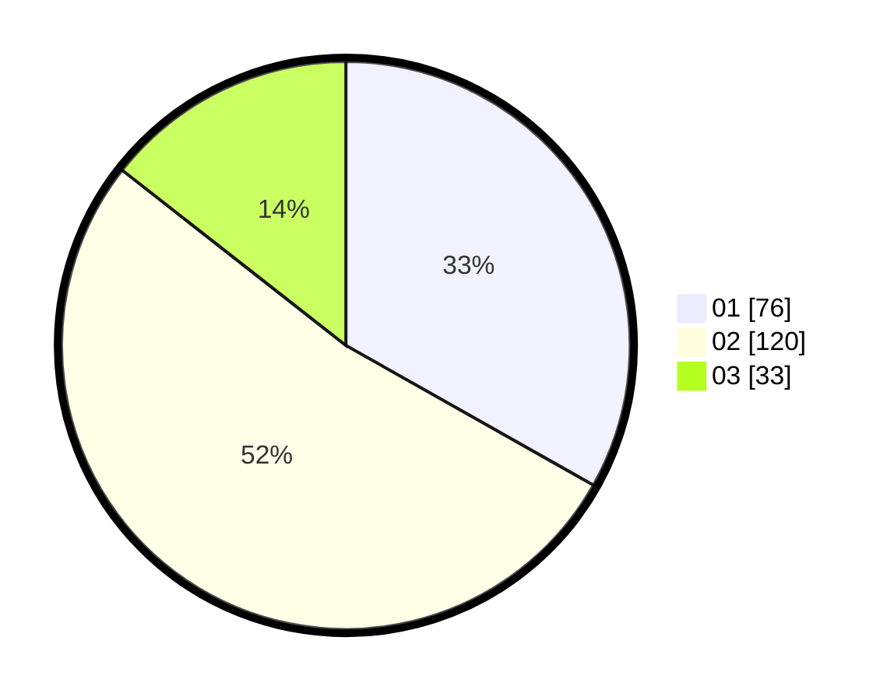

# Hasil

Hasil perolehan suara paslon dapat dilihat pada file paslon-01.txt, paslon-02.txt, dan paslon-03.txt.

Jika tidak ada, artinya data tersebut belum ada pada SIREKAP.

## Perolehan Suara

 * Paslon 01: **76**.
 * Paslon 02: **120**.
 * Paslon 03: **33**.

## Foto C Plano

https://sirekap-obj-formc.kpu.go.id/5448/pemilu/ppwp/31/75/01/10/06/3175011006010-20240214-214124--0b91a50b-85b9-4901-bc77-9ea6a6b30cc8.jpg

https://sirekap-obj-formc.kpu.go.id/5448/pemilu/ppwp/31/75/01/10/06/3175011006010-20240214-214605--9d6c69da-6e55-4102-b878-2da8db726412.jpg

https://sirekap-obj-formc.kpu.go.id/5448/pemilu/ppwp/31/75/01/10/06/3175011006010-20240214-214803--d8a2135b-5601-4943-ace9-5f5e45ff6189.jpg
