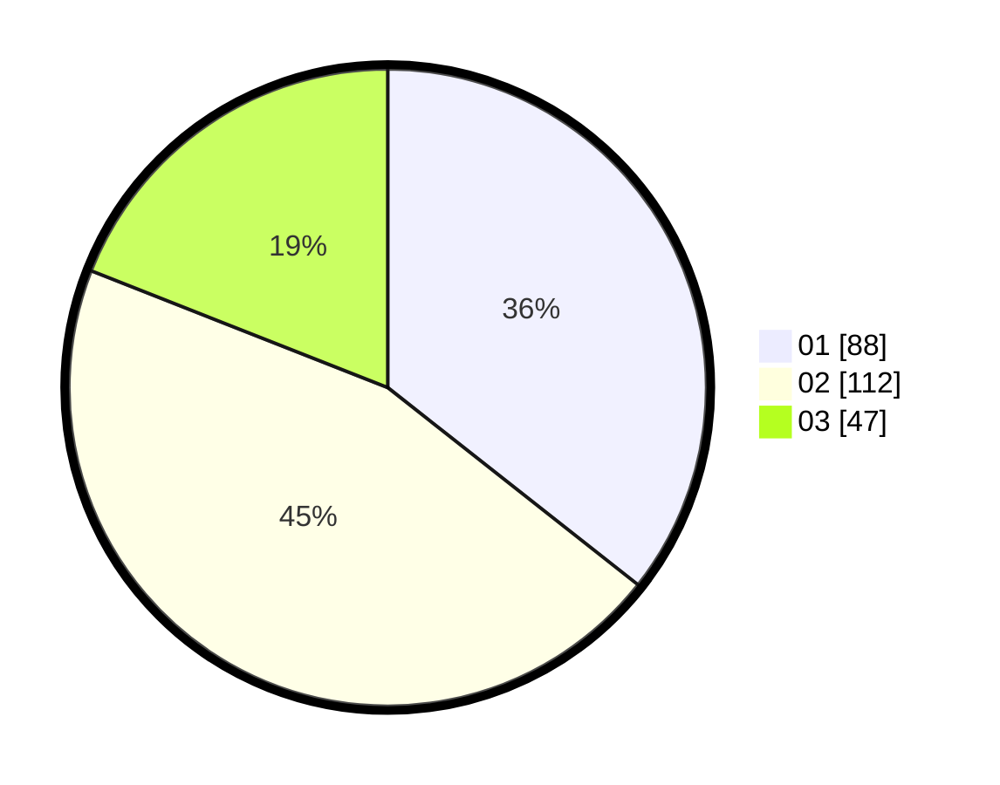

# Hasil

Hasil perolehan suara paslon dapat dilihat pada file paslon-01.txt, paslon-02.txt, dan paslon-03.txt.

Jika tidak ada, artinya data tersebut belum ada pada SIREKAP.

## Perolehan Suara

 * Paslon 01: **88**.
 * Paslon 02: **112**.
 * Paslon 03: **47**.

## Foto C Plano

https://sirekap-obj-formc.kpu.go.id/91dd/pemilu/ppwp/31/75/01/10/06/3175011006011-20240214-220754--5d395aa5-bf85-4c2c-af82-cb0bffa9cf9c.jpg

https://sirekap-obj-formc.kpu.go.id/91dd/pemilu/ppwp/31/75/01/10/06/3175011006011-20240214-221252--b7e0e4e5-de13-4539-be5b-d3fa6e863723.jpg

https://sirekap-obj-formc.kpu.go.id/91dd/pemilu/ppwp/31/75/01/10/06/3175011006011-20240214-210742--f7d45c02-621a-4b48-bce2-6a3ab1f02f49.jpg
