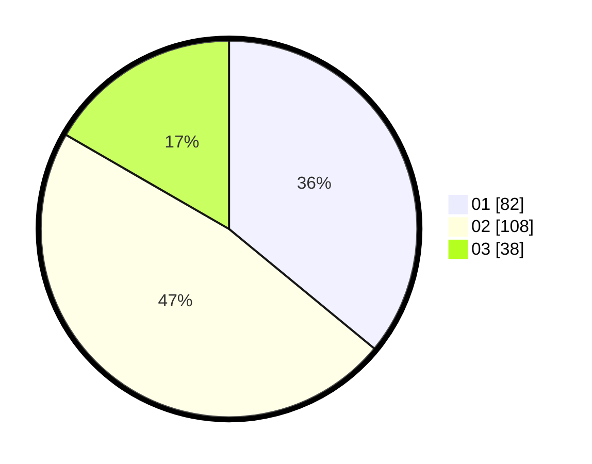

# Hasil

Hasil perolehan suara paslon dapat dilihat pada file paslon-01.txt, paslon-02.txt, dan paslon-03.txt.

Jika tidak ada, artinya data tersebut belum ada pada SIREKAP.

## Perolehan Suara

 * Paslon 01: **82**.
 * Paslon 02: **108**.
 * Paslon 03: **38**.

## Foto C Plano

https://sirekap-obj-formc.kpu.go.id/375f/pemilu/ppwp/31/75/01/10/06/3175011006012-20240214-193057--7ff7a068-055b-4b3f-9de0-dcae9210f5e1.jpg

https://sirekap-obj-formc.kpu.go.id/375f/pemilu/ppwp/31/75/01/10/06/3175011006012-20240214-193557--940ab581-3271-484d-b828-8f4483d545d2.jpg

https://sirekap-obj-formc.kpu.go.id/375f/pemilu/ppwp/31/75/01/10/06/3175011006012-20240214-194122--4ac81660-6e0d-43f9-b135-b7822c2ef3a1.jpg

## DATA PEMILIH TETAP

Jumlah pemilih dalam DPT: **291**.
 * L: **147**.
 * P: **144**.

## DATA PENGGUNA HAK PILIH

Jumlah pengguna hak pilih dalam DPT: **225**.
 * L: **112**.
 * P: **113**.

Jumlah pengguna hak pilih dalam DPTb: **4**.
 * L: **2**.
 * P: **2**.

Jumlah pengguna hak pilih dalam DPK: **3**.
 * L: **2**.
 * P: **1**.

Jumlah pengguna hak pilih: **232**.
 * L: **116**.
 * P: **116**.

## JUMLAH SUARA SAH DAN TIDAK SAH

JUMLAH SELURUH SUARA SAH: **228**.

JUMLAH SUARA TIDAK SAH: **4**.

JUMLAH SELURUH SUARA SAH DAN SUARA TIDAK SAH: **232**.
