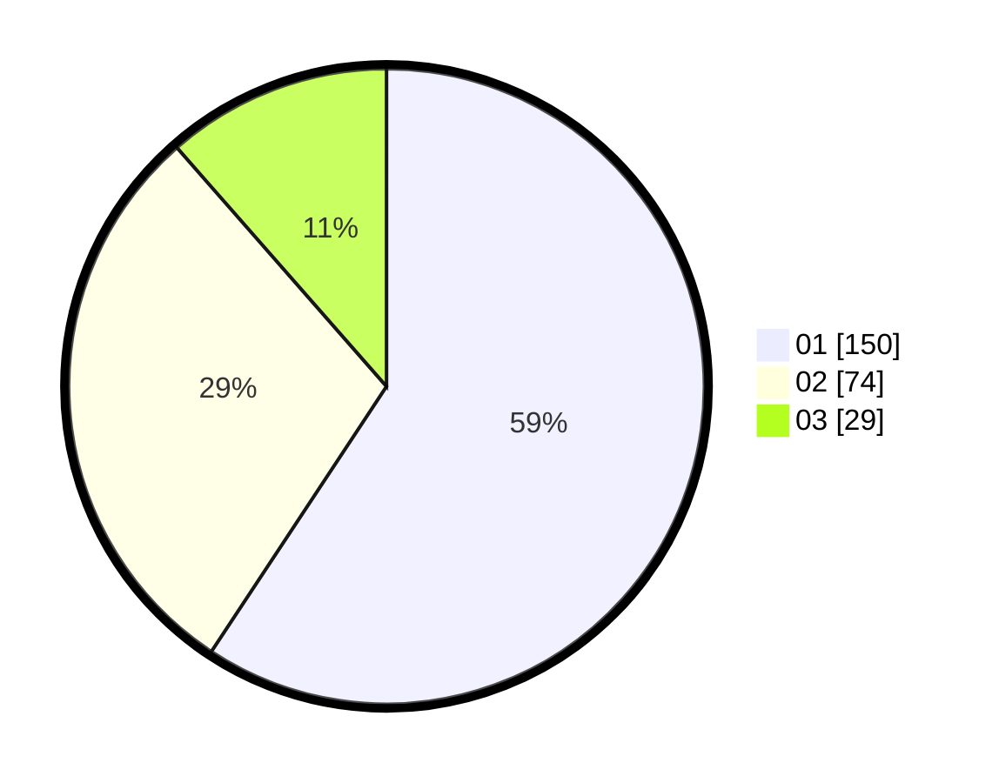

# Hasil

Hasil perolehan suara paslon dapat dilihat pada file paslon-01.txt, paslon-02.txt, dan paslon-03.txt.

Jika tidak ada, artinya data tersebut belum ada pada SIREKAP.

## Perolehan Suara

 * Paslon 01: **150**.
 * Paslon 02: **74**.
 * Paslon 03: **29**.

## Foto C Plano

https://sirekap-obj-formc.kpu.go.id/a0a9/pemilu/ppwp/31/75/01/10/06/3175011006013-20240216-110924--c05b5dd9-e923-4aa4-8d93-c169419f70d7.jpg

https://sirekap-obj-formc.kpu.go.id/a0a9/pemilu/ppwp/31/75/01/10/06/3175011006013-20240216-111215--5a9adf5c-3e91-4cf7-afca-bfd8f419db07.jpg

https://sirekap-obj-formc.kpu.go.id/a0a9/pemilu/ppwp/31/75/01/10/06/3175011006013-20240216-224058--a3e3c7cb-85af-446d-9b3d-fbc4670e2fbb.jpg
