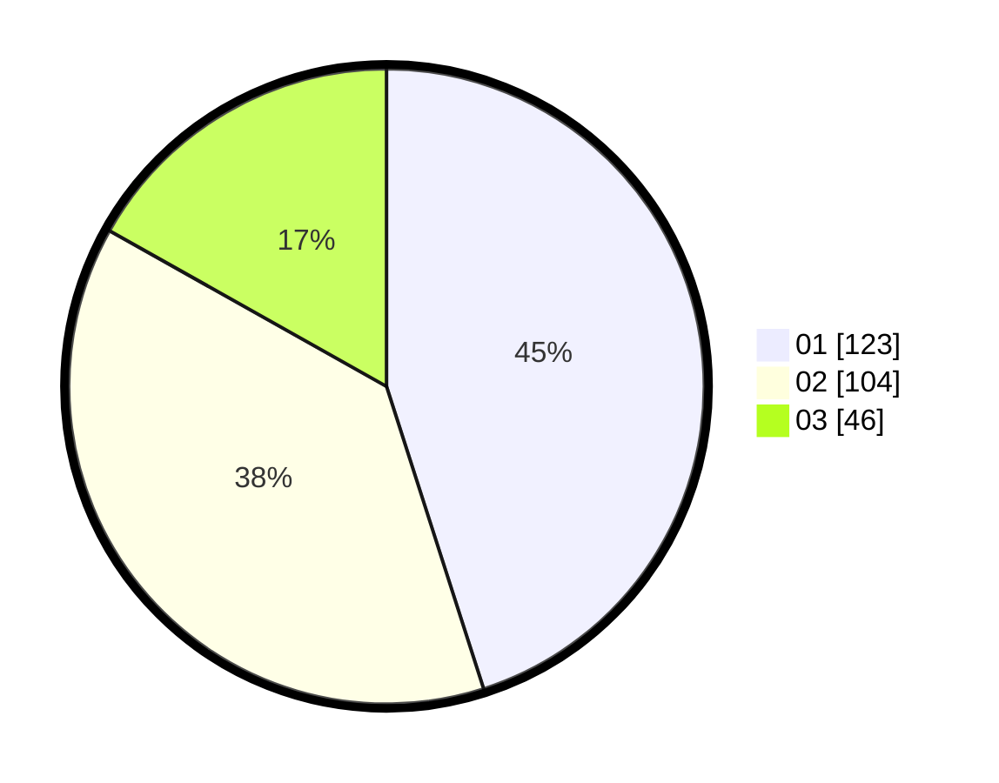

# Hasil

Hasil perolehan suara paslon dapat dilihat pada file paslon-01.txt, paslon-02.txt, dan paslon-03.txt.

Jika tidak ada, artinya data tersebut belum ada pada SIREKAP.

## Perolehan Suara

 * Paslon 01: **123**.
 * Paslon 02: **104**.
 * Paslon 03: **46**.

## Foto C Plano

https://sirekap-obj-formc.kpu.go.id/9806/pemilu/ppwp/31/75/01/10/06/3175011006015-20240214-222506--92714f7d-be16-4685-a843-f19fc9505d22.jpg

https://sirekap-obj-formc.kpu.go.id/9806/pemilu/ppwp/31/75/01/10/06/3175011006015-20240214-222515--259388ca-feca-487f-8737-2b8276fc931f.jpg

https://sirekap-obj-formc.kpu.go.id/9806/pemilu/ppwp/31/75/01/10/06/3175011006015-20240214-222520--3f4f9060-581a-4b71-891c-f107927e5b54.jpg
