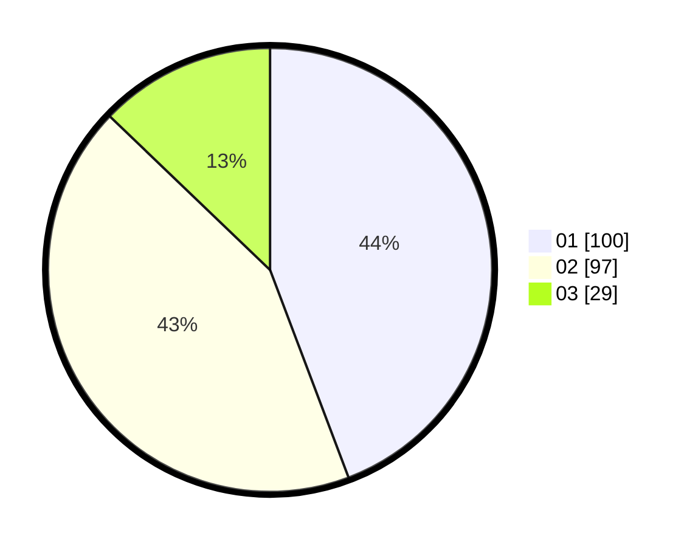

# Hasil

Hasil perolehan suara paslon dapat dilihat pada file paslon-01.txt, paslon-02.txt, dan paslon-03.txt.

Jika tidak ada, artinya data tersebut belum ada pada SIREKAP.

## Perolehan Suara

 * Paslon 01: **100**.
 * Paslon 02: **97**.
 * Paslon 03: **29**.

## Foto C Plano

https://sirekap-obj-formc.kpu.go.id/79d4/pemilu/ppwp/31/75/01/10/06/3175011006021-20240214-185937--0c7b1c92-6998-41fb-965b-1f86ae9132e2.jpg

https://sirekap-obj-formc.kpu.go.id/79d4/pemilu/ppwp/31/75/01/10/06/3175011006021-20240214-185723--29375476-ea55-4d69-8549-3a10f835c29c.jpg

https://sirekap-obj-formc.kpu.go.id/79d4/pemilu/ppwp/31/75/01/10/06/3175011006021-20240214-185606--58b01a05-3cee-4765-a158-975d7f3110f5.jpg

## DATA PEMILIH TETAP

Jumlah pemilih dalam DPT: **269**.
 * L: **141**.
 * P: **128**.

## DATA PENGGUNA HAK PILIH

Jumlah pengguna hak pilih dalam DPT: **227**.
 * L: **116**.
 * P: **111**.

Jumlah pengguna hak pilih dalam DPTb: **0**.
 * L: **0**.
 * P: **0**.

Jumlah pengguna hak pilih dalam DPK: **1**.
 * L: **0**.
 * P: **1**.

Jumlah pengguna hak pilih: **228**.
 * L: **116**.
 * P: **112**.

## JUMLAH SUARA SAH DAN TIDAK SAH

JUMLAH SELURUH SUARA SAH: **226**.

JUMLAH SUARA TIDAK SAH: **2**.

JUMLAH SELURUH SUARA SAH DAN SUARA TIDAK SAH: **228**.
