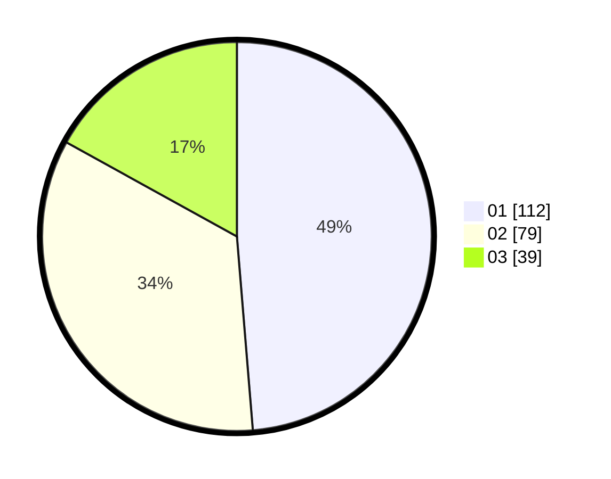

# Hasil

Hasil perolehan suara paslon dapat dilihat pada file paslon-01.txt, paslon-02.txt, dan paslon-03.txt.

Jika tidak ada, artinya data tersebut belum ada pada SIREKAP.

## Perolehan Suara

 * Paslon 01: **112**.
 * Paslon 02: **79**.
 * Paslon 03: **39**.

## Foto C Plano

https://sirekap-obj-formc.kpu.go.id/ee8e/pemilu/ppwp/31/75/01/10/06/3175011006026-20240215-025215--fee073bf-6895-4834-a75a-73e57c223b93.jpg

https://sirekap-obj-formc.kpu.go.id/ee8e/pemilu/ppwp/31/75/01/10/06/3175011006026-20240214-223135--c51135e4-3006-419c-8efe-c9a2850372d8.jpg

https://sirekap-obj-formc.kpu.go.id/ee8e/pemilu/ppwp/31/75/01/10/06/3175011006026-20240215-020658--5a6676da-f98b-4670-af6e-208c77f1bdf5.jpg
