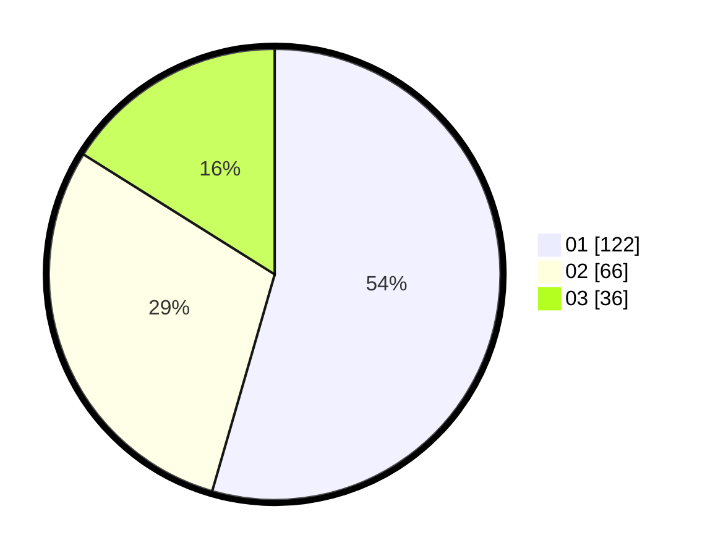

# Hasil

Hasil perolehan suara paslon dapat dilihat pada file paslon-01.txt, paslon-02.txt, dan paslon-03.txt.

Jika tidak ada, artinya data tersebut belum ada pada SIREKAP.

## Perolehan Suara

 * Paslon 01: **122**.
 * Paslon 02: **66**.
 * Paslon 03: **36**.

## Foto C Plano

https://sirekap-obj-formc.kpu.go.id/24e6/pemilu/ppwp/31/75/01/10/06/3175011006027-20240214-230308--aeee81de-b9b2-465b-bfab-2ec2889a417e.jpg

https://sirekap-obj-formc.kpu.go.id/24e6/pemilu/ppwp/31/75/01/10/06/3175011006027-20240214-230418--89f597a8-09cd-436d-879f-ae1ea368fef6.jpg

https://sirekap-obj-formc.kpu.go.id/24e6/pemilu/ppwp/31/75/01/10/06/3175011006027-20240214-230539--3c060789-5f9d-48d9-b4e2-6b053c3fb3aa.jpg
