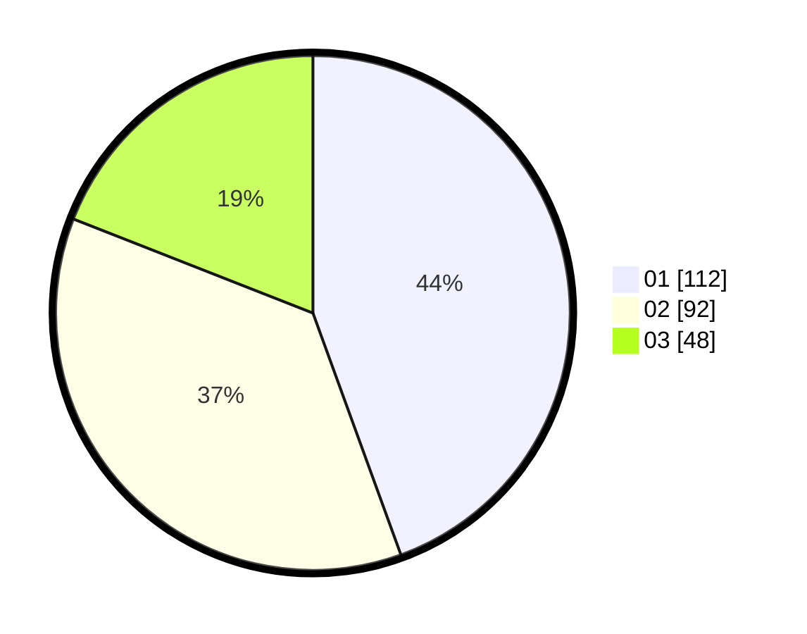

# Hasil

Hasil perolehan suara paslon dapat dilihat pada file paslon-01.txt, paslon-02.txt, dan paslon-03.txt.

Jika tidak ada, artinya data tersebut belum ada pada SIREKAP.

## Perolehan Suara

 * Paslon 01: **112**.
 * Paslon 02: **92**.
 * Paslon 03: **48**.

## Foto C Plano

https://sirekap-obj-formc.kpu.go.id/4c32/pemilu/ppwp/31/75/01/10/06/3175011006029-20240215-023019--ed86ef15-70ae-42ad-82c8-69027521ccb7.jpg

https://sirekap-obj-formc.kpu.go.id/4c32/pemilu/ppwp/31/75/01/10/06/3175011006029-20240215-014557--6570d3f6-16a6-46d9-bff8-edc0cd8e481b.jpg

https://sirekap-obj-formc.kpu.go.id/4c32/pemilu/ppwp/31/75/01/10/06/3175011006029-20240215-023749--b9391749-2722-4ebe-9762-d5f87ef9de12.jpg
