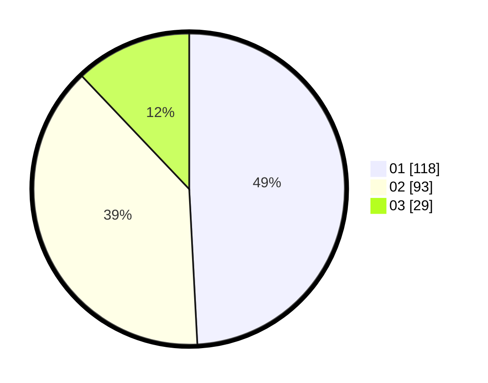

# Hasil

Hasil perolehan suara paslon dapat dilihat pada file paslon-01.txt, paslon-02.txt, dan paslon-03.txt.

Jika tidak ada, artinya data tersebut belum ada pada SIREKAP.

## Perolehan Suara

 * Paslon 01: **118**.
 * Paslon 02: **93**.
 * Paslon 03: **29**.

## Foto C Plano

https://sirekap-obj-formc.kpu.go.id/2ffb/pemilu/ppwp/31/75/01/10/06/3175011006034-20240214-195420--934ff1d2-1b5b-4042-9046-9c1ca6ac3b75.jpg

https://sirekap-obj-formc.kpu.go.id/2ffb/pemilu/ppwp/31/75/01/10/06/3175011006034-20240214-233827--2e644813-05ad-44b0-ab85-4e03ec36fbae.jpg

https://sirekap-obj-formc.kpu.go.id/2ffb/pemilu/ppwp/31/75/01/10/06/3175011006034-20240214-195736--7d6965e7-a227-4c1c-be83-9fb2e0f88711.jpg
