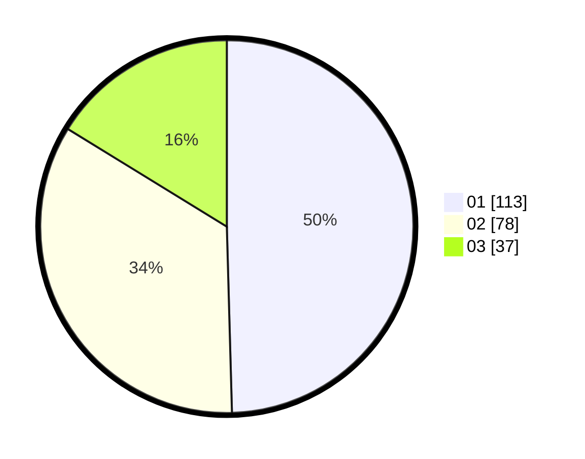

# Hasil

Hasil perolehan suara paslon dapat dilihat pada file paslon-01.txt, paslon-02.txt, dan paslon-03.txt.

Jika tidak ada, artinya data tersebut belum ada pada SIREKAP.

## Perolehan Suara

 * Paslon 01: **113**.
 * Paslon 02: **78**.
 * Paslon 03: **37**.

## Foto C Plano

https://sirekap-obj-formc.kpu.go.id/afe4/pemilu/ppwp/31/75/01/10/06/3175011006038-20240216-162833--3646515c-a062-4cdb-899d-cd6b22eaefa0.jpg

https://sirekap-obj-formc.kpu.go.id/afe4/pemilu/ppwp/31/75/01/10/06/3175011006038-20240216-162834--37204cde-baf6-4ea8-8b63-2eb4954fbe48.jpg

https://sirekap-obj-formc.kpu.go.id/afe4/pemilu/ppwp/31/75/01/10/06/3175011006038-20240216-162833--d3e102d9-f325-49cb-ab33-fe3feca34c85.jpg

## DATA PEMILIH TETAP

Jumlah pemilih dalam DPT: **277**.
 * L: **138**.
 * P: **139**.

## DATA PENGGUNA HAK PILIH

Jumlah pengguna hak pilih dalam DPT: **228**.
 * L: **112**.
 * P: **116**.

Jumlah pengguna hak pilih dalam DPTb: **5**.
 * L: **3**.
 * P: **2**.

Jumlah pengguna hak pilih dalam DPK: **0**.
 * L: **0**.
 * P: **0**.

Jumlah pengguna hak pilih: **233**.
 * L: **115**.
 * P: **118**.

## JUMLAH SUARA SAH DAN TIDAK SAH

JUMLAH SELURUH SUARA SAH: **228**.

JUMLAH SUARA TIDAK SAH: **5**.

JUMLAH SELURUH SUARA SAH DAN SUARA TIDAK SAH: **233**.
