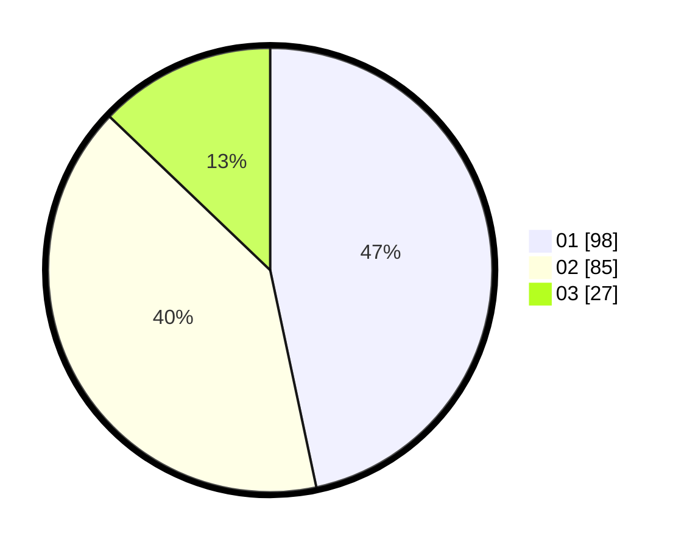

# Hasil

Hasil perolehan suara paslon dapat dilihat pada file paslon-01.txt, paslon-02.txt, dan paslon-03.txt.

Jika tidak ada, artinya data tersebut belum ada pada SIREKAP.

## Perolehan Suara

 * Paslon 01: **98**.
 * Paslon 02: **85**.
 * Paslon 03: **27**.

## Foto C Plano

https://sirekap-obj-formc.kpu.go.id/7a63/pemilu/ppwp/31/75/01/10/06/3175011006043-20240217-221936--56476e65-b17a-4b01-a76c-0bece372ac56.jpg

https://sirekap-obj-formc.kpu.go.id/7a63/pemilu/ppwp/31/75/01/10/06/3175011006043-20240217-222952--6ba392c6-a391-44b1-ab3c-b17374e0c8c5.jpg

https://sirekap-obj-formc.kpu.go.id/7a63/pemilu/ppwp/31/75/01/10/06/3175011006043-20240217-222727--77b2e30b-0d6f-4f4b-8a3d-258f3d0bc1b0.jpg

## DATA PEMILIH TETAP

Jumlah pemilih dalam DPT: **279**.
 * L: **142**.
 * P: **137**.

## DATA PENGGUNA HAK PILIH

Jumlah pengguna hak pilih dalam DPT: **213**.
 * L: **105**.
 * P: **108**.

Jumlah pengguna hak pilih dalam DPTb: **1**.
 * L: **1**.
 * P: **0**.

Jumlah pengguna hak pilih dalam DPK: **1**.
 * L: **1**.
 * P: **0**.

Jumlah pengguna hak pilih: **215**.
 * L: **107**.
 * P: **108**.

## JUMLAH SUARA SAH DAN TIDAK SAH

JUMLAH SELURUH SUARA SAH: **210**.

JUMLAH SUARA TIDAK SAH: **5**.

JUMLAH SELURUH SUARA SAH DAN SUARA TIDAK SAH: **215**.
