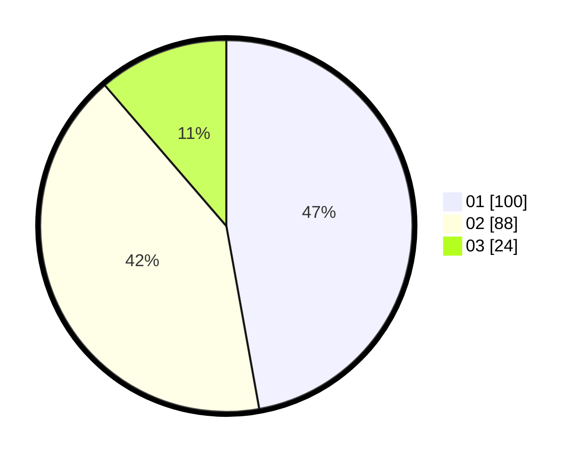

# Hasil

Hasil perolehan suara paslon dapat dilihat pada file paslon-01.txt, paslon-02.txt, dan paslon-03.txt.

Jika tidak ada, artinya data tersebut belum ada pada SIREKAP.

## Perolehan Suara

 * Paslon 01: **100**.
 * Paslon 02: **88**.
 * Paslon 03: **24**.

## Foto C Plano

https://sirekap-obj-formc.kpu.go.id/83cb/pemilu/ppwp/31/75/01/10/06/3175011006046-20240214-155214--7e60ed61-9a3c-4fd2-b324-85a124ca8c8b.jpg

https://sirekap-obj-formc.kpu.go.id/83cb/pemilu/ppwp/31/75/01/10/06/3175011006046-20240214-155813--8c6151d7-bea6-4133-a9c0-ab00296c485c.jpg
