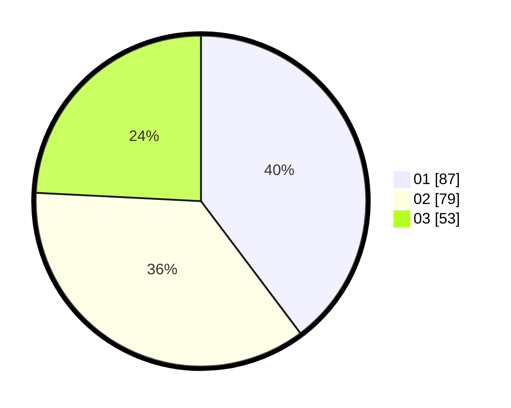

# Hasil

Hasil perolehan suara paslon dapat dilihat pada file paslon-01.txt, paslon-02.txt, dan paslon-03.txt.

Jika tidak ada, artinya data tersebut belum ada pada SIREKAP.

## Perolehan Suara

 * Paslon 01: **87**.
 * Paslon 02: **79**.
 * Paslon 03: **53**.

## Foto C Plano

https://sirekap-obj-formc.kpu.go.id/97a0/pemilu/ppwp/31/75/01/10/06/3175011006047-20240217-153604--7f03faab-8c44-4a5b-b0e2-71077e672082.jpg

https://sirekap-obj-formc.kpu.go.id/97a0/pemilu/ppwp/31/75/01/10/06/3175011006047-20240217-153653--b0a903b7-d8d8-44c7-9c9f-3459f10bb2ca.jpg

https://sirekap-obj-formc.kpu.go.id/97a0/pemilu/ppwp/31/75/01/10/06/3175011006047-20240217-153703--cede334b-8527-4d3a-af7a-df90f70546be.jpg
