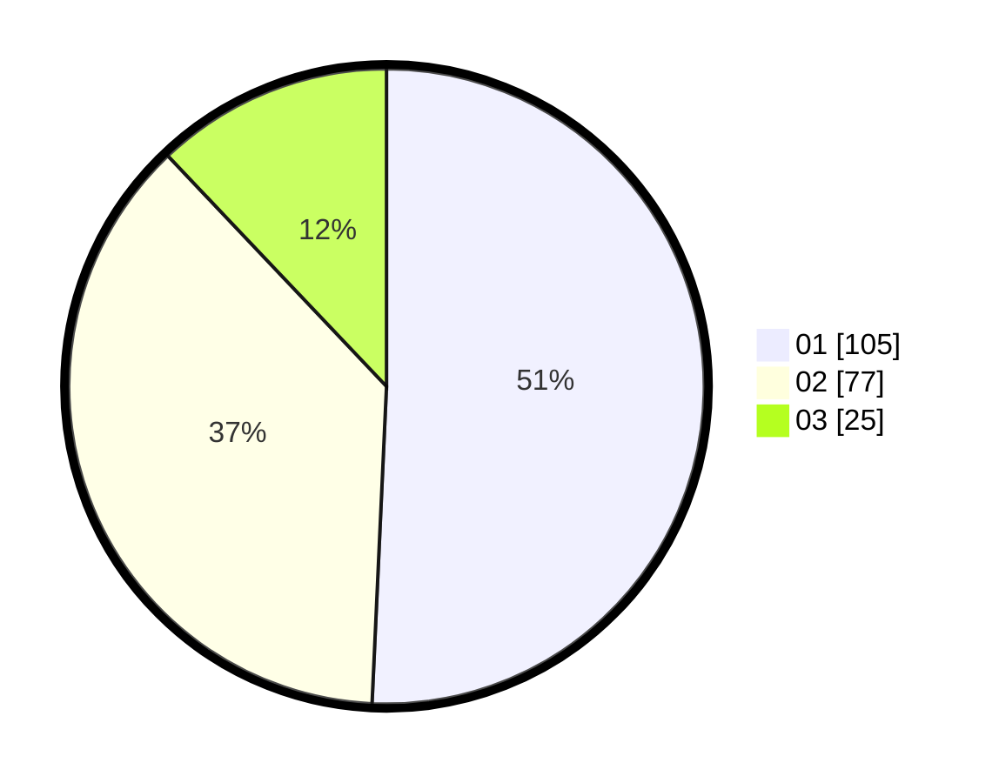

# Hasil

Hasil perolehan suara paslon dapat dilihat pada file paslon-01.txt, paslon-02.txt, dan paslon-03.txt.

Jika tidak ada, artinya data tersebut belum ada pada SIREKAP.

## Perolehan Suara

 * Paslon 01: **105**.
 * Paslon 02: **77**.
 * Paslon 03: **25**.

## Foto C Plano

https://sirekap-obj-formc.kpu.go.id/6132/pemilu/ppwp/31/75/01/10/06/3175011006052-20240215-010309--6c4646c4-1bec-401e-8389-fbfc3c2da2c4.jpg

https://sirekap-obj-formc.kpu.go.id/6132/pemilu/ppwp/31/75/01/10/06/3175011006052-20240215-200340--674839b8-c049-47f1-a583-3f15a380aacf.jpg

https://sirekap-obj-formc.kpu.go.id/6132/pemilu/ppwp/31/75/01/10/06/3175011006052-20240216-035037--12c4f0c1-084f-4bdf-9ab1-a00e8009a5e2.jpg

## DATA PEMILIH TETAP

Jumlah pemilih dalam DPT: **283**.
 * L: **128**.
 * P: **155**.

## DATA PENGGUNA HAK PILIH

Jumlah pengguna hak pilih dalam DPT: **208**.
 * L: **94**.
 * P: **114**.

Jumlah pengguna hak pilih dalam DPTb: **4**.
 * L: **3**.
 * P: **1**.

Jumlah pengguna hak pilih dalam DPK: **1**.
 * L: **0**.
 * P: **1**.

Jumlah pengguna hak pilih: **213**.
 * L: **97**.
 * P: **116**.

## JUMLAH SUARA SAH DAN TIDAK SAH

JUMLAH SELURUH SUARA SAH: **207**.

JUMLAH SUARA TIDAK SAH: **6**.

JUMLAH SELURUH SUARA SAH DAN SUARA TIDAK SAH: **213**.
