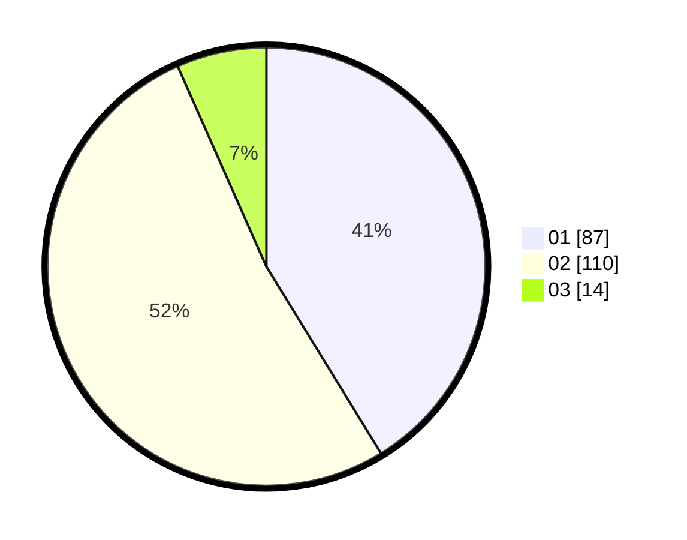

# Hasil

Hasil perolehan suara paslon dapat dilihat pada file paslon-01.txt, paslon-02.txt, dan paslon-03.txt.

Jika tidak ada, artinya data tersebut belum ada pada SIREKAP.

## Perolehan Suara

 * Paslon 01: **87**.
 * Paslon 02: **110**.
 * Paslon 03: **14**.

## Foto C Plano

https://sirekap-obj-formc.kpu.go.id/5774/pemilu/ppwp/31/75/01/10/06/3175011006059-20240214-213235--998acfa5-bd33-4ffb-a214-d605e89a562f.jpg

https://sirekap-obj-formc.kpu.go.id/5774/pemilu/ppwp/31/75/01/10/06/3175011006059-20240214-213324--0643db5f-02e3-40cf-8f9f-00b31dfe0eaa.jpg

https://sirekap-obj-formc.kpu.go.id/5774/pemilu/ppwp/31/75/01/10/06/3175011006059-20240214-201334--09b3f594-65e2-4088-99c0-30fb5ca9cf31.jpg
