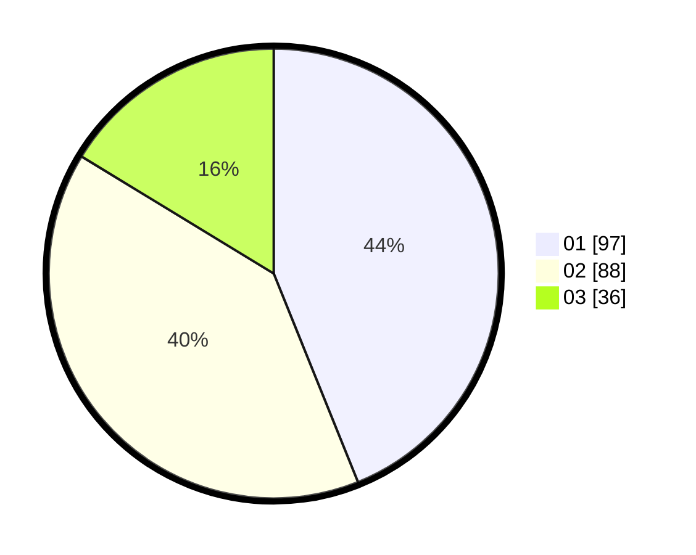

# Hasil

Hasil perolehan suara paslon dapat dilihat pada file paslon-01.txt, paslon-02.txt, dan paslon-03.txt.

Jika tidak ada, artinya data tersebut belum ada pada SIREKAP.

## Perolehan Suara

 * Paslon 01: **97**.
 * Paslon 02: **88**.
 * Paslon 03: **36**.

## Foto C Plano

https://sirekap-obj-formc.kpu.go.id/c011/pemilu/ppwp/31/75/01/10/06/3175011006061-20240214-191432--4b342708-5f3f-4240-aaff-81ed2c5464b5.jpg

https://sirekap-obj-formc.kpu.go.id/c011/pemilu/ppwp/31/75/01/10/06/3175011006061-20240214-192228--480b3709-1e35-4baf-a530-a6ebbed97119.jpg

https://sirekap-obj-formc.kpu.go.id/c011/pemilu/ppwp/31/75/01/10/06/3175011006061-20240214-192348--618f4804-396f-4ac3-8fe7-670643825ea9.jpg

## DATA PEMILIH TETAP

Jumlah pemilih dalam DPT: **266**.
 * L: **127**.
 * P: **139**.

## DATA PENGGUNA HAK PILIH

Jumlah pengguna hak pilih dalam DPT: **219**.
 * L: **98**.
 * P: **121**.

Jumlah pengguna hak pilih dalam DPTb: **0**.
 * L: **0**.
 * P: **0**.

Jumlah pengguna hak pilih dalam DPK: **4**.
 * L: **2**.
 * P: **2**.

Jumlah pengguna hak pilih: **223**.
 * L: **100**.
 * P: **123**.

## JUMLAH SUARA SAH DAN TIDAK SAH

JUMLAH SELURUH SUARA SAH: **221**.

JUMLAH SUARA TIDAK SAH: **2**.

JUMLAH SELURUH SUARA SAH DAN SUARA TIDAK SAH: **223**.
