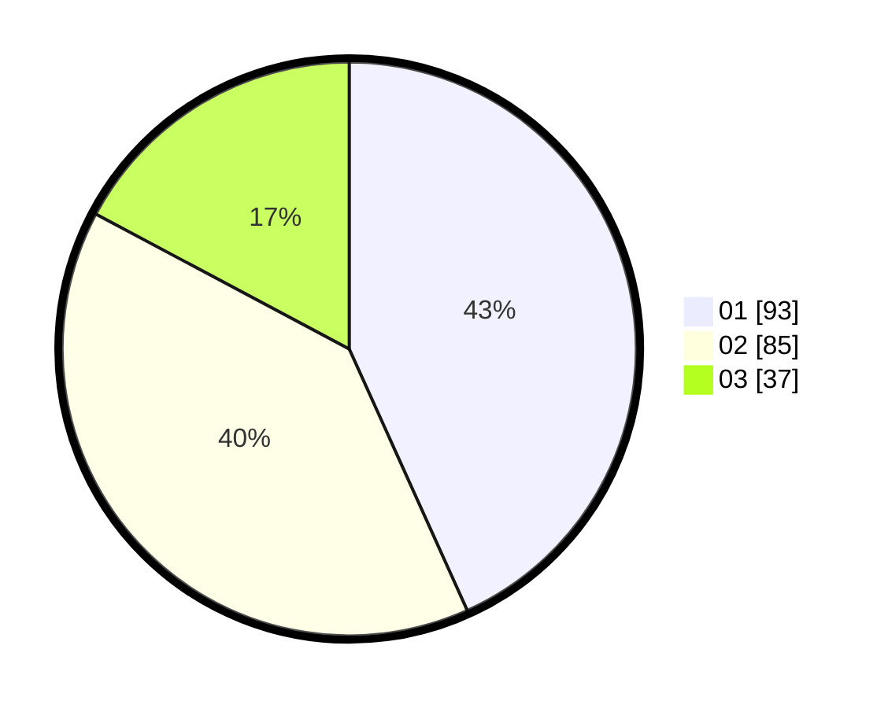

# Hasil

Hasil perolehan suara paslon dapat dilihat pada file paslon-01.txt, paslon-02.txt, dan paslon-03.txt.

Jika tidak ada, artinya data tersebut belum ada pada SIREKAP.

## Perolehan Suara

 * Paslon 01: **93**.
 * Paslon 02: **85**.
 * Paslon 03: **37**.

## Foto C Plano

https://sirekap-obj-formc.kpu.go.id/e865/pemilu/ppwp/31/75/01/10/06/3175011006066-20240214-230316--a538d3e4-01b8-4189-a325-d5c363955470.jpg

https://sirekap-obj-formc.kpu.go.id/e865/pemilu/ppwp/31/75/01/10/06/3175011006066-20240214-205236--858d14d5-3ecd-47a2-ad38-fc963fab6648.jpg

https://sirekap-obj-formc.kpu.go.id/e865/pemilu/ppwp/31/75/01/10/06/3175011006066-20240214-230409--660efeee-d869-4ad5-a104-803345197b4f.jpg
